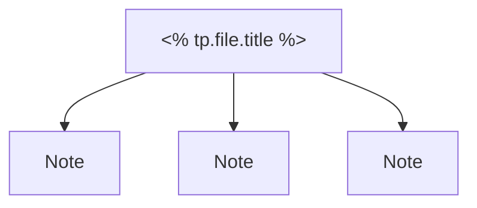

# <% tp.file.title %>

One paragraph: what cluster does this MOC hold together, and why does it need a hub?

## Structure

```mermaid
flowchart TD
    A[<% tp.file.title %>] --> B[Note]
    A --> C[Note]
    A --> D[Note]
```

## Linked notes

- [[]]
- [[]]
