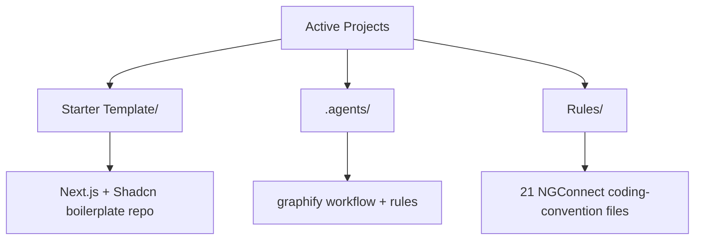

# Active Projects

Hub for reusable, actively-used project infrastructure — as opposed to [[App Ideas]] (concepts not yet built) or [[Profile]] (personal skills). Everything here is either a real starting-point repo or operational config copied verbatim from a real project, meant to be reused as-is in the next one.

> [!note] Naming note
> `Active Projects/Rules/` (NGConnect's coding rules, copied verbatim below) is a different thing from this vault's own `Rules/` folder at the top level (the vault's note-taking rules — see [[00 - Rules Index]]). Same word, two unrelated purposes — don't conflate them.

## Structure

## Contents

| Folder | What it is | Source |
|---|---|---|
| [[Starter Template]] | Next.js + Shadcn UI boilerplate — the default new-project starting point | [github.com/Nitinsudarshan/boilerplate](https://github.com/Nitinsudarshan/boilerplate.git) |
| `.agents/` | Claude Code agent workflow/rule config (the `graphify` codebase-knowledge-graph workflow, plus its always-on rule and a version/changelog rule) | Copied verbatim from [NGConnect's `.agents/`](https://github.com/Nitinsudarshan/NGConnect/tree/main/.agents) |
| `Rules/` | 21 coding-convention files (code standards, component architecture, data access, security, RBAC, forms/validation, testing, API conventions, performance, accessibility, design system, and more) | Copied verbatim from [NGConnect's `rules/`](https://github.com/Nitinsudarshan/NGConnect/tree/main/rules) |

`.agents/` and `Rules/` are exempt from this vault's frontmatter schema (see [[03 - Frontmatter and Metadata]]) — they're operational configuration copied verbatim to be reused as-is in a future project, not vault-native knowledge notes.

## My Take

The `.agents`/`Rules` split here is genuinely reusable beyond NGConnect specifically: `global.md`'s precedence ordering (safety/correctness rules > architecture rules > style rules > design rules > documentation) is a pattern worth carrying into any future Next.js/Supabase project, not just this one. Starting a new project from [[Starter Template]] plus these two folders gets most of the way to NGConnect's actual working conventions without any of its application-specific code.

## Related

- [[Starter Template]]
- [[00 - Rules Index]]
- [[Product & Systems Design]]
