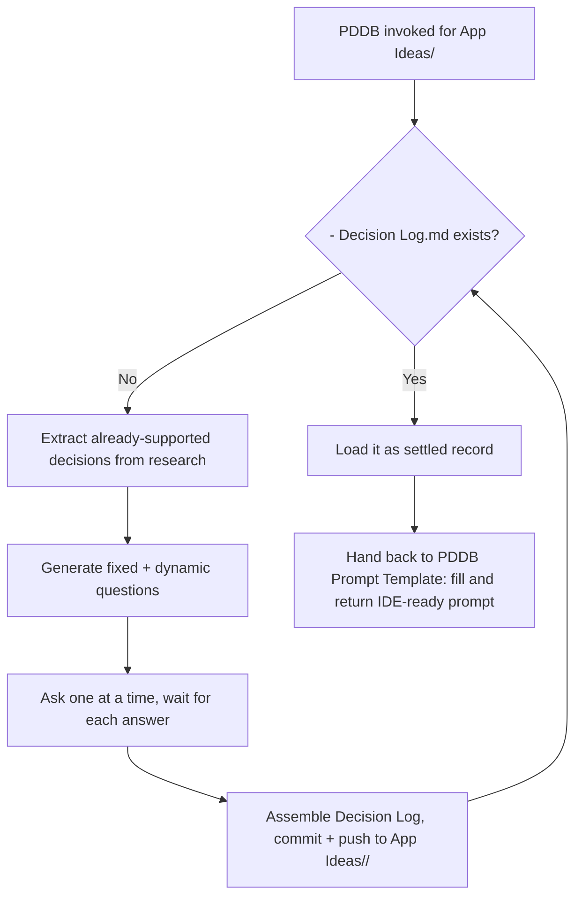

# Decision Loop

## Summary

Decision Loop is the gate [[PDDB Prompt Template]] runs before it generates an IDE-ready build prompt. It checks whether the target `App Ideas/<AppName>/` folder already has a `<AppName> - Decision Log.md`; if one exists, PDDB proceeds straight to prompt generation using it as the settled record. If not, Decision Loop drives a one-question-at-a-time interview to produce that file first — asking specifically for the things no amount of research can answer (which IDE will build this, which repo it extends) — then hands control back to PDDB.

---

## 1. Why this exists

Running the [[Relay - Brief|Relay]] PDDB generation once (2026-08-18) surfaced a real gap: PDDB's Decision Log section pulls from whatever the research notes state, but some decisions aren't in the research at all — they can't be, because they're about *how this gets built*, not *what gets built*. "Which repo does this extend?" and "which IDE is running this prompt?" showed up as open questions every time, because nothing in `App Ideas/Relay/` was ever going to answer them. Re-discovering the same gap on every future PDDB run for every app is wasted effort. Decision Loop asks those questions exactly once per app, permanently records the answers, and lets every later PDDB run for that app skip straight to building.

## 2. Trigger

Invoked automatically as the first step of [[PDDB Prompt Template]]'s generation procedure — never called directly by name. Takes the same `<AppName>` PDDB was given.

## 3. The gate

Check whether `App Ideas/<AppName>/<AppName> - Decision Log.md` exists.

- **Exists** → read it, treat every entry in it as settled and non-negotiable (same rule PDDB already applies to research-derived decisions), skip straight to §7 below.
- **Missing** → run the interview in §4.

## 4. Question-generation procedure (when the gate fails)

1. Read every note under `App Ideas/<AppName>/`.
2. Extract every decision that's *already* fully supported — a clear "recommended X over Y" or "explicitly deferred" with context, reason, alternatives, and impact all present in the text. These go straight into the new decision log with no question asked; this is most of the log for a well-researched app (7 of 7 for [[Relay - Brief|Relay]] on the first pass).
3. From what's left, generate questions in three categories:
   - **Fixed — build-environment questions**, asked for every app, because research notes are never going to answer these:
     a. Which IDE or AI coding assistant is going to build this (e.g. Claude Code, Cursor, Windsurf)? The generated prompt's assumptions about available tools/conventions depend on the answer.
     b. Target repo: a brand-new repo, or an existing codebase this extends? If existing, the exact path or URL — this was Relay's actual blocker, since it extends an unnamed "Mnemos" codebase.
     c. Any hard constraint on timeline, budget, or platform not already captured in the research.
   - **Decision-completeness questions**: for every "explicitly deferred," "worth a spike," or "left open" phrase found in the research that never resolves to a final call, ask directly rather than defaulting silently.
   - **Architecture-ambiguity questions**: anywhere two notes disagree, or a choice is phrased as "either X or Y" with no final pick (Relay's Brief leaves Electron-vs-Tauri open even though every other Relay note assumes Tauri), ask which one wins.
4. Present the questions **one at a time**, in that order, and wait for an answer before asking the next one. Don't batch them — the point is a real interview, not a form.
5. After the last answer, assemble `<AppName> - Decision Log.md`: research-derived decisions from step 2 first, then one new entry per answered question, all in the shared format:

```
Decision:
Context:
Decision made:
Reason:
Alternatives considered:
Impact:
```

6. Give the new note full vault frontmatter (see [[03 - Frontmatter and Metadata]]), link it from and to the app's existing notes (see [[05 - Linking and Graph Discipline]]), commit, and push it to `App Ideas/<AppName>/`.
7. Re-run the gate in §3 — it now passes — and hand control back to [[PDDB Prompt Template]] to generate the IDE-ready prompt using this file as the Decision Log source for its own §9.

## 5. What counts as a good question here

- Never ask something already inferable from the research — that would violate the same anti-over-ask discipline [[PDDB Prompt Template]] applies to the IDE agent itself; this loop has to hold itself to the same bar it hands downstream.
- Never turn a low-impact, reversible detail into a mandatory question — the fixed build-environment questions in §4 earn their place only because guessing them wrong means baking a wrong assumption permanently into a generated prompt, not because they're interesting.
- Every question must map to exactly one Decision Log entry — if a question doesn't produce a Decision/Context/Reason/Alternatives/Impact record, it's the wrong question to be asking here.



## My Take

The useful realization here isn't the interview mechanic itself — it's that a research folder can be genuinely excellent (as Relay's is) and still be structurally incapable of answering certain questions, because those questions are about the build process, not the product. Splitting "decisions research already made" from "decisions only I can make" into two different extraction passes is what stops that second category from silently defaulting to a guess inside a generated prompt.

## Related

- [[PDDB Prompt Template]]
- [[App Ideas]]
- [[Active Projects]]
