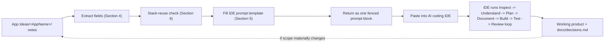

# PDDB Prompt Template

## Summary

PDDB (**P**lan → **D**ocument → **D**ecide → **B**uild) is a meta-prompt framework that converts an already-researched [[App Ideas]] concept into a single, self-contained prompt an AI coding IDE can run against a fresh or existing repo — inspecting, specifying, deciding, and building with minimal round-trips back to me. Invoke it as: *"generate a prompt for App Ideas/&lt;AppName&gt; based on Active Projects/PDDB Prompt Template.md"* — the assistant reads every note under that App Ideas subfolder, fills the template in §5 below, and hands back an IDE-ready prompt.

---

## 1. What PDDB stands for

| Stage | What it means here |
|---|---|
| **Plan** | Read the App Ideas research (Brief, Competitive Research, Implementation Options, Technology Stacks, MVP and Recommendation) and turn it into a build plan the IDE can act on immediately |
| **Document** | Seed a living `/docs` spec inside the target repo so the plan survives past the first prompt |
| **Decide** | Pre-answer every product/architecture question the research already settled, so the IDE agent inherits decisions instead of re-asking them |
| **Build** | Hand the IDE agent the same Inspect → Understand → Plan → Document → Build → Test → Review → Continue loop from the reference [[AI IDE Operating Mode|operating-mode instructions]], scoped to this specific app |

The whole point is closing the gap between "I did the research" and "the IDE is building the right thing" without a manual re-explaining step in between — the same capture-to-action instinct behind [[Relay - Brief|Relay]] itself, applied to my own build workflow.

## File manifest — what exists for `<AppName>` at each stage

| Stage | Trigger | Files created |
|---|---|---|
| 0. Research (not part of this framework — manual, or via [[Git Repo Research Framework]]) | You research the idea | `<AppName> - Brief.md`, `- Competitive Research.md`, `- Implementation Options.md`, `- Technology Stacks.md`, `- MVP and Recommendation.md` |
| 1. [[Decision Loop]] | First PDDB invocation, only if `<AppName> - Decision Log.md` doesn't exist yet | `<AppName> - Decision Log.md` — created once, then **amended** (not recreated) whenever a new clarification surfaces later, the same way [[Relay - Decision Log]]'s Decision 12 was added after the fact |
| 2. PDDB generation (§3 steps 2–7) | Every PDDB invocation | `<AppName> - IDE Build Prompt.md` — regenerated/overwritten whenever the decision log or research changes materially, never a second source of truth alongside it |
| 3. Agent/rule config seeding (§3 step 8) | Once, when the build prompt is settled and it's time to actually start building | `<AppName>/AGENTS.md`, `<AppName>/Rules/*.md` (however many apply after the keep/adapt/rescope/drop pass in step 8), `<AppName>/.agents/**` |

Stages 1–3 also **edit** two existing files rather than creating new ones —
`App Ideas/App Ideas.md`'s diagram/table gets a node added for each new
artifact, and `<AppName> - Brief.md`'s "Related notes" section gets a link
added for each one. This is what keeps the graph from accumulating orphan
notes as the framework runs (see [[05 - Linking and Graph Discipline]]).
Rerunning any stage never touches stage 0's research notes — everything
downstream is a derived artifact, regenerated from them, not a parallel
source of truth.

## 2. How to invoke this framework

Say (or write in a request):

> Generate a prompt for `App Ideas/<AppName>` based on `Active Projects/PDDB Prompt Template.md`

`<AppName>` must match an existing subfolder under `App Ideas/` (e.g. `Relay`, `Operon`). No other input is required — every field the generated prompt needs comes from files already in that folder plus the shared references in §6.

## 3. Generation procedure (what happens when this is invoked)

1. **Run the [[Decision Loop]] gate first.** Check whether `App Ideas/<AppName>/<AppName> - Decision Log.md` exists.
   - If it doesn't, stop here and hand off to [[Decision Loop]]'s interview procedure instead of continuing to step 2 — it will read the research, ask whatever it can't derive (one question at a time), assemble the decision log, commit it, and only then return control here.
   - If it does, continue to step 2 with that file already in hand.
2. **Read every note** under `App Ideas/<AppName>/` — typically `<AppName> - Brief`, `- Competitive Research`, `- Implementation Options`, `- Technology Stacks`, `- MVP and Recommendation`, `- Decision Log`, but read whatever actually exists rather than assuming that exact set.
3. **Extract fields** per the mapping table in §4. If a field has no source (a note is missing or a section wasn't written), infer the most reasonable value from what *is* there and record the gap as an open item in the generated Decision Log seed — do not block generation on a missing note.
4. **Run the stack-reuse check** in §6 against [[Starter Template]] and `Active Projects/.agents` / `Active Projects/Rules`.
5. **Fill the template in §5** with the extracted fields, sourcing §5.9's Decision Log directly from `<AppName> - Decision Log.md` rather than re-deriving it from the other research notes.
6. **Return the filled template as a single fenced prompt block, and persist it** to `App Ideas/<AppName>/<AppName> - IDE Build Prompt.md` (full vault frontmatter, linked from and to the app's other notes) — commit and push it like any other note. The chat block is for immediate use; the file is the durable record, so a later session (or a different IDE entirely) doesn't need this conversation to pick it back up. Regenerate and overwrite this file whenever the decision log or research changes materially — it's a derived artifact, not a second source of truth.
7. Do **not** ask me clarifying questions during generation unless the source notes are genuinely silent on something that changes MVP scope or architecture (mirrors §7 below) — if the research or the decision log already made the call, use it. [[Decision Loop]] is where the "only I can answer this" questions get asked, once, up front — not here.
8. **Seed the app's own agent/rule config as the last step**, once the build prompt itself is settled: adapt `Active Projects/.agents/`, `Active Projects/Rules/`, and [NGConnect's AGENTS.md](https://github.com/Nitinsudarshan/NGConnect/blob/main/AGENTS.md) into `App Ideas/<AppName>/.agents/`, `App Ideas/<AppName>/Rules/`, and `App Ideas/<AppName>/AGENTS.md`. This is not a copy — it's a real adaptation pass:
   - Read the confirmed stack in `<AppName> - Decision Log.md` (and the generated build prompt's §8) first. NGConnect's rule set assumes a single Next.js + Supabase app; most apps generated here won't match that shape exactly.
   - For each NGConnect rule file, decide: **keep as-is** (genuinely stack-agnostic, e.g. accessibility, documentation format), **adapt** (same principle, different specifics — e.g. `data-access.md` splitting into local-storage vs. cloud-storage sections if the app has both), **rescope** (still valid, but only for one surface of a multi-surface app — e.g. `server-client-boundary.md` only applies where there's an actual Next.js App Router), or **drop** (no analog in this app's feature set at all — e.g. `data-import.md` if there's no file-import feature; `greetings.md`-style bespoke NGConnect component docs never apply). Say explicitly which files were dropped and why, in `AGENTS.md`'s own rule index — don't silently omit them.
   - Add net-new rule files for any part of the stack NGConnect's rule set never covered at all (e.g. a Rust backend, a mobile shell, a CLI) — write one the same way the existing files are written: `trigger`/`description`/`globs` frontmatter, a short rationale, concrete rules, not abstract principles.
   - `global.md` (or `AGENTS.md`'s own index) must state which files apply to which surface when the app has more than one (native/web/CLI/etc.) — a rule file that silently assumes a single surface will get misapplied.
   - These new folders and the new `AGENTS.md` are **exempt from this vault's frontmatter schema**, the same as `Active Projects/.agents/` and `Active Projects/Rules/` — see [[03 - Frontmatter and Metadata]] §5 and `scripts/lint_vault.py`'s `EXEMPT_PATTERNS`. They're operational config meant to be dropped into the app's real repo unchanged, not vault-native notes.
   - Link the new set from the app's Brief (a short mention in its "Related notes" section is enough — these aren't wikilink-style vault notes, so a plain reference is fine, matching how [[Active Projects]] itself references its own `.agents/`/`Rules/`).

## 4. Field mapping — App Ideas notes → prompt placeholders

| Placeholder | Sourced from | Notes |
|---|---|---|
| `{{APP_NAME}}` | Folder name | e.g. `Relay` |
| `{{ONE_LINE_PITCH}}` | `- Brief`, "What it is" | Keep it to 1–2 sentences |
| `{{CORE_PROBLEM}}` | `- MVP and Recommendation`, "Final Recommendation → Core problem" (or `- Brief` if absent) | |
| `{{PRIMARY_USERS}}` | `- MVP and Recommendation`, "Who it should initially serve" | Default to "the builder, personal use" if unstated |
| `{{FEATURE_SET}}` | `- Brief`, "Feature set" | Verbatim list, lightly normalized |
| `{{MVP_SCOPE}}` + tier table | `- MVP and Recommendation`, "MVP definition" and "Tiers" | Carries Post-MVP/Later/Experimental forward as explicit **out-of-scope-for-now**, not deleted ideas |
| `{{CORE_WORKFLOW}}` | `- MVP and Recommendation`, "Core workflow" / MVP diagram | Reproduce or re-describe the flow diagram in words |
| `{{RECOMMENDED_STACK}}` | `- MVP and Recommendation`, "Recommended stack" (cross-check `- Technology Stacks`) | |
| `{{REUSE_ASSETS}}` | `- MVP and Recommendation`, "What to reuse" + §6 stack-reuse check below | |
| `{{EXCLUDED_APPROACHES}}` | `- MVP and Recommendation`, "What NOT to build" | Becomes a hard constraint, not a suggestion |
| `{{COMPETITIVE_DIFFERENTIATION}}` | `- MVP and Recommendation`, "USPs" / "Competitive differentiation"; `- Competitive Research` | |
| `{{TECHNICAL_RISKS}}` / `{{PRODUCT_RISKS}}` | `- MVP and Recommendation`, "Biggest technical/product risks" | Feed directly into what gets tested first |
| `{{FIRST_MILESTONES}}` | `- MVP and Recommendation`, "First N development milestones" | Becomes the vertical-slice build order (§7 of the reference operating mode) |
| `{{DECISION_LOG_SEED}}` | `<AppName> - Decision Log.md`, produced by [[Decision Loop]] before this step ever runs | Every decision is already final — none of these should be reopened by the IDE agent |
| `{{OPEN_QUESTIONS}}` | Anything the research flagged as unresolved that [[Decision Loop]] didn't already turn into a decision, plus any gap found during step 3 of §3 | These are the *only* things the generated prompt should tell the IDE to actually stop and ask about |

## 5. The IDE-ready prompt template

This is the payload that gets filled and returned. `{{DOUBLE_BRACE}}` placeholders get replaced with real content per §4 — nothing double-braced should survive into the final output. This is a plain meta-prompt convention, unrelated to Obsidian's Templater syntax used in `06-Templates/` (see [[09 - Plugin Stack]]).

```
# {{APP_NAME}} — AI IDE Build Prompt

## Operating Mode

You are operating inside an IDE with access to this repository, its files,
configuration, and available development tools. The project context in this
repo — plus the pre-answered context below, which comes from prior product
research — is your source of truth. Your job is not to produce documentation.
Your job is to take this project from:

Context → Understanding → Specification → Implementation → Testing → Working Product

## Pre-Answered Product Context (do not re-ask these)

**What it is**: {{ONE_LINE_PITCH}}
**Core problem**: {{CORE_PROBLEM}}
**Primary users**: {{PRIMARY_USERS}}
**Feature set**: {{FEATURE_SET}}
**Core workflow**: {{CORE_WORKFLOW}}
**MVP scope**: {{MVP_SCOPE}}
**Explicitly out of scope for now**: (Post-MVP / Later / Experimental tiers from research)
**Recommended stack**: {{RECOMMENDED_STACK}}
**What to reuse instead of rebuilding**: {{REUSE_ASSETS}}
**What NOT to build, and why**: {{EXCLUDED_APPROACHES}}
**Competitive differentiation**: {{COMPETITIVE_DIFFERENTIATION}}
**Known technical risks**: {{TECHNICAL_RISKS}}
**Known product risks**: {{PRODUCT_RISKS}}

These answers already reflect a full research pass (competitive research,
implementation options, stack comparison, MVP scoping). Treat them as settled
decisions, not open questions — do not ask me to re-confirm any of them.

## 1. First, Inspect the Project

Before asking questions or proposing architecture:
- Inspect the repository, existing docs, source code, configuration, and
  dependency files.
- Identify the existing stack, schema, integrations, conventions, and what's
  already implemented vs. incomplete/placeholder.
- Do not ask me for anything determinable by inspecting the project or already
  answered above.

## 2. Establish Project State

- **State A — Idea/Empty**: little or no implementation → begin from the
  pre-answered context above and start specification.
- **State B — Partially Specified**: some decisions exist, gaps remain →
  fill gaps using the pre-answered context first, ask only about genuine
  conflicts.
- **State C — Partially Built**: substantial implementation exists →
  understand it first, diff it against the pre-answered context, then
  continue.
- **State D — Existing Product**: it already works, this is an enhancement →
  treat it as baseline, extend without unnecessarily breaking it.

## 3. Do Not Over-Ask Questions

Do not ask when the answer is inferable from the project, from the
pre-answered context above, or is a low-impact/reversible implementation
detail. Ask me only when a decision materially changes product behavior,
requirements conflict, there's a real security/privacy/data-loss implication,
or scope/architecture would materially change. Group questions together and
explain why each answer matters. Known open items to raise if they become
blocking (nothing else should): {{OPEN_QUESTIONS}}

## 4. Do Not Wait for Perfect Documentation

Once the core problem, users, MVP scope, workflows, and stack (all above) are
understood, mark the project **READY ENOUGH TO BUILD** and begin.

## 5. Build While Learning

Understand → Specify → Build small piece → Test → Learn → Update
specification → Build next piece. Don't over-document straightforward
decisions.

## 6. Maintain a Living Specification

Create `/docs` in this repo with at minimum: `product.md`, `requirements.md`,
`user-flows.md`, `architecture.md`, `data-model.md`, `api.md`, `decisions.md`,
`testing.md`. Seed `product.md` and `decisions.md` from the pre-answered
context and the decision log below on the first pass, then keep them current
as implementation changes anything important.

## 7. Build Incrementally

Break implementation into vertical slices, tested and integrated before
moving on. Use this order unless inspection reveals a better one:

{{FIRST_MILESTONES}}

## 8. Stack and Reuse Directive

{{REUSE_ASSETS}}

Do not introduce a new framework, database, state layer, ORM, UI library, or
service without documenting why in `decisions.md` first.

## 9. Decision Log — seeded from the confirmed decision log

Record every material decision in `docs/decisions.md` in this format:

```
Decision:
Context:
Decision made:
Reason:
Alternatives considered:
Impact:
```

Pre-seed it with these decisions, taken from {{APP_NAME}} - Decision Log.md —
every one of these has already been through the [[Decision Loop]] process, so
do not relitigate them without a real new reason:

{{DECISION_LOG_SEED}}

## 10. Do Not Fake Functionality

No feature counts as done if it only looks right in the UI, uses
hardcoded/mock data, skips auth/permissions, doesn't persist required data, or
doesn't handle errors. Mocks are fine mid-development if explicitly marked
temporary and replaced before the feature is called production-ready.

## 11. Validate as You Build

After each meaningful feature: run tests, check types/lint/build, check
migrations, check the relevant user flow and its error states. Don't
accumulate large amounts of untested code.

## 12. Protect Existing Functionality

Before changing anything that already works: understand it, check its
dependents and tests, make the smallest safe change, verify it still works.

## 13. Definition of Done

A feature is done when: it's implemented, the UI works, data persists
correctly, permissions/validation/error states work, edge cases from
{{TECHNICAL_RISKS}} / {{PRODUCT_RISKS}} are handled, tests pass, nothing
else broke, and `/docs` reflects it.

## 14. When to Stop and Ask Me

Only for: two requirements conflicting, an ambiguous destructive data
operation, an unclear privacy/security call, a request that fundamentally
changes MVP scope, two incompatible workflow interpretations, or a major
architecture change not covered above. Otherwise, decide and continue.

## 15. Default Behavior

Behave like a senior product engineer, not a consultant who only produces
plans: Inspect → Understand → Plan → Document → Build → Test → Review →
Continue. If the project is sufficiently clear — and per the pre-answered
context above, it is — start building without waiting to be told
"now start coding."
```

## 6. Stack-reuse check

Run this before filling `{{REUSE_ASSETS}}`:

- If `{{RECOMMENDED_STACK}}` is Next.js/React/TypeScript-based → instruct the generated prompt to start from [[Starter Template]] (`github.com/Nitinsudarshan/boilerplate`) plus `Active Projects/.agents/` and `Active Projects/Rules/` copied in verbatim, per [[Active Projects]].
- If the recommended stack is something else entirely (e.g. Relay's Tauri + Python/FastAPI stack, which extends the separate Mnemos codebase rather than the web boilerplate) → say explicitly in `{{REUSE_ASSETS}}` that [[Starter Template]] does **not** apply, name the actual base to extend instead (an existing sibling project's stack, if one is named in the research), and still require the same `/docs` + decision-log discipline.
- Either way, the generated prompt must name a concrete base to extend or scaffold from — never leave the IDE agent to guess between "start fresh" and "reuse something."

## 7. Worked example — Relay

Running this against `App Ideas/Relay/` would fill the header block as:

> **What it is**: A hybrid (local + cloud) AI voice and memory assistant that turns captured voice into structured, actionable system state — a Kanban card, a calendar event, a polished document.
> **Core problem**: Closing the gap between "I said something" and "something useful happened," without manual re-entry.
> **Recommended stack**: Tauri + Python/FastAPI + Whisper + Piper + Ollama/hybrid LLM + LanceDB + markdown vault (Stack B from [[Relay - Technology Stacks]]).
> **What to reuse**: Mnemos's existing Whisper/Piper/Ollama/LanceDB/Tauri stack and its 3 existing MCP servers — **not** [[Starter Template]], since Relay isn't a Next.js web app.
> **What NOT to build**: a meeting-bot architecture, full GraphRAG on day one, a fully custom Kanban app before the parsing logic is validated.

...with the full 10-milestone list from [[Relay - MVP and Recommendation]] dropped straight into §7 of the template as the build order, and its "recommended Stack B over A/C," "bot-free design over meeting-bot," and "extend Mnemos over fresh build" calls pre-seeded into the decision log.



## My Take

The part worth protecting here isn't the operating-mode text itself — that's the reference prompt largely unchanged — it's §9's pre-seeded Decision Log. Every hour already spent in a `- Competitive Research` or `- MVP and Recommendation` note deciding "Stack B over A" or "bot-free over meeting-bot" is wasted if the IDE agent re-derives (or worse, re-litigates) the same call from scratch on day one. Feeding those decisions in as already-made, with their reasons attached, is what actually gets an IDE agent to build instead of re-plan.

## Related

- [[App Ideas]]
- [[Active Projects]]
- [[Starter Template]]
- [[Git Repo Research Framework]]
- [[Decision Loop]]
- [[Relay - Brief]]
