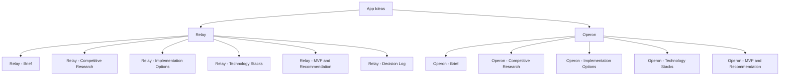

# App Ideas

Hub for personal-project app concepts that get taken through a full research → build-plan → MVP pass before any code gets written, using [[Git Repo Research Framework]] as the research methodology and my current capability set in [[Technical Skills & Technology Stack]] as the fit-check.

## Structure

## Concepts

| App | One-line pitch | Status |
|---|---|---|
| [[Relay - Brief\|Relay]] | Hybrid (local + cloud) voice memory assistant — meeting notes become a Kanban board, voice commands trigger reminders/calendar actions directly | Researched |
| [[Operon - Brief\|Operon]] | AI-native Operations Copilot — describe a business process in plain English, get a designed, generated, and deployed workflow | Researched |

## My Take

Both concepts share a spine even though they look unrelated on the surface: take unstructured human input (voice, or a plain-English process description) and turn it into structured, actionable system state (a Kanban card, a calendar event, a running workflow) with as little manual re-entry as possible. That's the same "capture → structure → act" loop, applied to personal knowledge work in Relay and to business operations in Operon — worth remembering if either one's architecture turns out to generalize to the other.

## Related

- [[Technical Skills & Technology Stack]]
- [[Git Repo Research Framework]]
