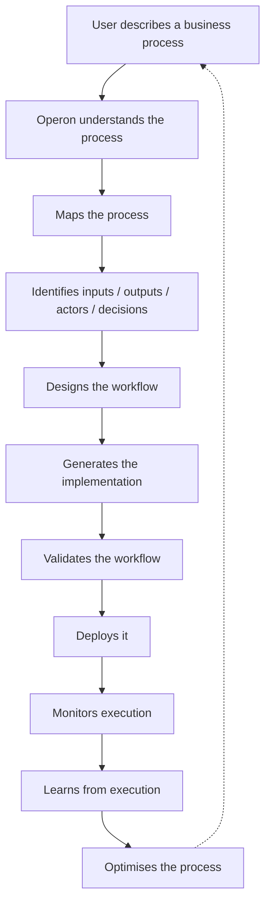
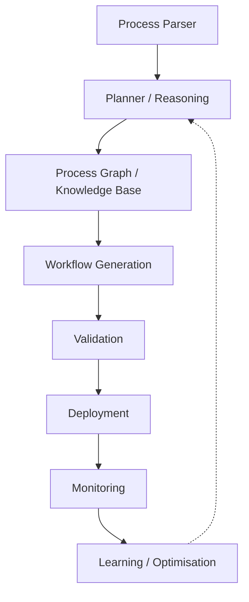

# Operon

## What it is

Operon is an **AI-native Operations Copilot / Operations Automation Platform**. Core vision:

> An AI-native platform that understands, designs, automates, documents, executes, monitors, and continuously optimizes business operations.

Core pitch:

> "Describe your business process in plain English. Operon designs, builds, documents, deploys, and optimizes it."

A user describes a business process in natural language; Operon understands it, maps it, designs a workflow, generates the implementation, validates it, deploys it, monitors execution, and optimizes it over time.

## Intended loop

## Previously-considered architecture (not assumed correct — validated in research)

Workflow generation was previously assumed to target n8n, Zapier, Make, Google Apps Script, Python, SQL, and APIs — as direct execution targets, connectors, code-generation targets, or optional integrations. [[Operon - Competitive Research]] validates or replaces this assumption rather than taking it as given.

## Capabilities under evaluation (necessity, not assumption)

RAG, embeddings, knowledge graphs, multi-agent planning, process documentation generation, workflow QA/validation, cost prediction, process mining, and process optimization were all previously floated. [[Operon - Competitive Research]] and [[Operon - MVP and Recommendation]] sort each into **required for MVP**, **useful later**, or **interesting but unnecessary**.

## Longer-term directions (not fixed requirements)

SaaS/team functionality, billing, audit trails, workflow versioning, enterprise SSO, RBAC, self-hosting, a marketplace, an SDK, an API, a CLI — potential directions to prioritize or drop based on research, not a checklist to build toward by default.

## Strategic intent

Real-world operational utility, not a demonstration of AI capability. The broader direction being explored is **open-source core + potential SaaS/business layer** — what should be open, what could stay proprietary, whether self-hosting matters, and whether a hosted layer creates real additional value are all open questions this research answers.

## Related notes

- [[Operon - Competitive Research]] — workflow engines, AI agent frameworks, AI workflow builders, process mining/BPM platforms, and the architecture validation
- [[Operon - Implementation Options]] — 3 cheap build paths
- [[Operon - Technology Stacks]] — 3 candidate stacks
- [[Operon - MVP and Recommendation]] — MVP scope, cost matrix, USPs, final recommendation, first 10 milestones

## Related

- [[Product & Systems Design]]
- [[App Ideas]]
- [[Automation & Workflow Engineering]]
