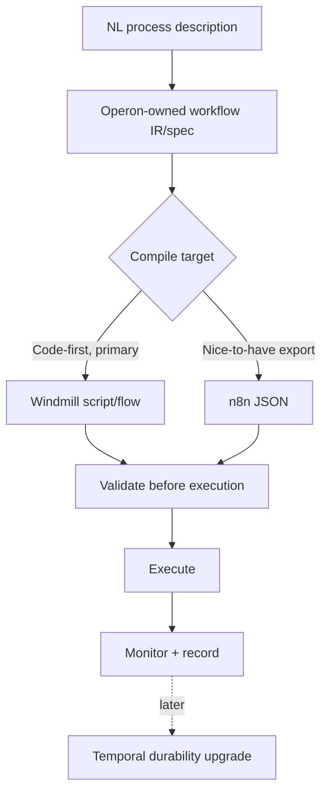

# Operon - Competitive Research

## Summary

Live research (Aug 17, 2026) across workflow engines, agent-orchestration frameworks, AI workflow builders, process mining, enterprise RPA/iPaaS, and the closest direct competitors, following [[Git Repo Research Framework]]. Treat stars/pricing/dates as an Aug-17-2026 snapshot. The single most important finding: **n8n, Zapier, and Make have all shipped their own native natural-language-to-workflow builders in this same window** — the "generate workflows that run inside n8n/Zapier/Make" architecture I'd previously assumed is now a weaker idea than when it was first floated, since it means competing against a feature those platforms already give away inside their own products.

## Master comparison table

| Project | License | Activity (Aug 2026) | NL→Workflow? | Self-host? | Category |
|---|---|---|---|---|---|
| n8n | Sustainable Use License (fair-code, not OSI-open) | Near-daily releases | **Yes**, native AI Workflow Builder | Yes | Workflow engine |
| Zapier | Proprietary | Continuous | Yes — Copilot generates a draft | No | Workflow engine |
| Make | Proprietary | Continuous, AI Agents beta | Yes — "Maia," built into the canvas | No | Workflow engine |
| Activepieces | MIT (CE) + commercial EE | Daily commits | Partial — AI-assist, no full spec generation | Yes | Workflow engine |
| Windmill | Dual AGPLv3/Apache-2.0 + EE | Releases every 1–3 days | No native NL layer; code-first | Yes | Code-first workflow engine |
| Temporal | MIT | Active, mature | No — pure durable-execution SDK | Yes | Execution substrate |
| Pipedream | Proprietary | Active (acquired by Workday, Nov 2025) | Some AI features | No | Workflow engine |
| LangGraph | MIT | Active, LangChain-backed | N/A (substrate) | Yes | Agent orchestration |
| CrewAI | MIT | Active | N/A (framework) | Yes | Agent orchestration |
| AG2 (ex-AutoGen) | Apache-2.0 | v1.0 full rewrite | N/A (framework) | Yes | Agent orchestration |
| Flowise | Apache-2.0 | **Archived Aug 13, 2026** | Visual only | Yes (moot) | AI workflow builder — dead |
| Langflow | MIT | Active | Visual only, no NL generation | Yes | AI workflow builder |
| Stack AI | Proprietary | **Acquired by Asana, May 2026** | Yes (RAG-oriented) | No | Acquired/absorbed |
| Gumloop | Proprietary | Active | Yes, visual + AI | No | AI workflow builder |
| Relevance AI | Proprietary | Active | Yes, "workforce" framing | No | AI workflow builder |
| **Lindy.ai** | Proprietary | Active | **Yes — this is its whole pitch** | No | Closest feature-level analog |
| Superagent | MIT | Active, **pivoted to red-teaming** | N/A now | Yes | Category exit |
| Celonis | Proprietary | Market leader | No (mining ≠ generation) | No | Process mining (benchmark) |
| PM4Py | AGPL-3.0 | Active | No | Yes (library) | Process mining (OSS) |
| UiPath | Proprietary | Active, "agentic" pivot | No (RPA-first) | No | RPA / enterprise |
| Workato | Proprietary | Active, Genies + Enterprise MCP | Yes, NL "recipes" | No | Enterprise iPaaS |
| Tray.ai | Proprietary | Active, Merlin Agent Builder | Yes | No | Enterprise iPaaS |
| **Coworker.ai** | Proprietary | Active, $16.5M raised | **Yes — closest direct match to Operon's pitch** | No | Direct competitor |
| Bardeen | Proprietary | Active, "Magic Box" | Yes | No | Adjacent (browser-automation-first) |

## Key findings by category

### Workflow engines / execution substrates
n8n has 1,500+ integrations and a production AI Workflow Builder (Claude Sonnet 4-based) already shipping — but its Sustainable Use License blocks reselling n8n-as-a-service, and durability is basic compared to Temporal. Zapier Copilot and Make's Maia are both proprietary, no-self-host, direct front-door competitors rather than infrastructure to build on. **Windmill** stands out: dual-licensed with a genuinely open core, code-first (Python/TS/Go/Bash → DAG), real sandboxing (nsjail), and a DAG-of-typed-functions model that's a much closer match to "validate, then execute, then monitor" than a visual canvas. **Temporal** has the strongest durability model of anything surveyed but is a pure SDK with no authoring UI or NL layer — a phase-2 upgrade, not a v1 dependency.

### Agent orchestration frameworks
LangGraph, CrewAI, and AG2 are all genuine libraries, not wrappers. LangGraph is the most credible foundation for Operon's planner — durable execution, human-in-the-loop support, and real named production usage (Klarna, Replit, Elastic cited). AG2 just underwent a full backward-incompatible v1.0 rewrite (old code forked to `ag2-classic`) — an abandonment/rewrite-risk signal worth noting per the framework's easy-to-miss checklist.

### AI workflow builders
Flowise was **archived by its own maintainers 4 days before this research** — an abandoned-adjacent signal, drop it from consideration entirely. Langflow (153k stars) is confirmed visual/manual only despite the "AI workflow" framing. Stack AI was acquired by Asana for $75M and is being absorbed into Asana's roadmap. Gumloop and Relevance AI are both fully closed-source, no-self-host, credit-metered.

### Process mining / BPM
Celonis is the dominant commercial benchmark (~50% market share, ~$150k/yr entry, 8–18 month implementations) — confirms process mining needs enterprise-scale production log data Operon has no way to source pre-launch. PM4Py is a real, actively-maintained open-source library, useful later for mining Operon's *own* execution logs, not a v1 pillar.

### Enterprise RPA / iPaaS
UiPath, Workato, and Tray.ai have all converged on the same "NL → automation" pitch (UiPath's Sep-2025 agentic pivot, Workato Genies, Tray's Merlin Agent Builder) — but gated behind five/six-figure enterprise contracts (Workato median customer ~$65k/yr, UiPath enterprise avg $430k/yr). These validate the market pain point, not usable infrastructure for a scrappy solo build.

### The direct competitor: Coworker.ai
Founded by ex-Uber execs, $16.5M raised, plain-English agents across 100+ integrations with a proprietary "Organizational Memory." This is functionally the closest live competitor to Operon's exact pitch, aimed at engineering/product/sales ops. Any Operon plan needs to differentiate against Coworker.ai specifically, not n8n or Zapier.

### The cautionary tale: Lindy.ai
The closest feature-level analog, and its complaint pattern is the most instructive finding in this research: real G2/Trustpilot complaints cite OAuth tokens not persisting on recurring triggers, credits burned by failed loops with no resolution, misdelivered emails, and "expensive"/"high subscription cost" as top complaint tags. Third-party verdict: *"Lindy works for occasional, supervised automations... not the right choice if you need precise, deterministic workflow automation."* An agent-first, non-deterministic execution model trades control for convenience in exactly the way that breaks trust for real ops workflows.

## Architecture validation

Reject targeting Zapier/Make as an execution substrate — proprietary, no build-on story, and now direct front-door competitors. n8n is workable for self-hosted personal use but license-constrained for commercial resale, and its own native AI builder already does the "describe it, get a workflow" step. **Windmill is the strongest architectural fit**: LLM-generated Python/TypeScript functions map far more naturally onto what an LLM is actually good at (writing code) than generating a visual builder's internal JSON graph does. The durable pattern is: **Operon should own a small, versioned, LLM-legible workflow spec (a typed IR — actors, steps, decisions, data contracts) and compile that into one or more backends**, rather than betting the whole architecture on any single third party's schema — the only approach that survives a competitor changing its API or license terms, which given how fast n8n/Zapier/Make are moving right now is a near-term risk, not a hypothetical one.

## Synthesis: what Operon should and shouldn't be

**Not** a general-purpose visual workflow builder (n8n/Activepieces/Windmill/Make/Zapier already do this well, free-to-cheap). **Not** an autonomous multi-app "digital coworker" agent (Coworker.ai/Lindy.ai own this lane, and Lindy's own complaint data shows it's a reliability trap at the current state of the art). **Not** a process-mining/intelligence platform (Celonis's moat is a decade of enterprise data-access depth; PM4Py is for later). **Not** an enterprise iPaaS/RPA replacement (UiPath/Workato/Tray own that budget and buyer).

**What fits**: a narrow, code-generating **process-to-automation compiler** — take a described process, produce a small, inspectable, versioned workflow specification plus a working implementation targeting a code-first runtime (Windmill first, n8n export as a nice-to-have), with validation and monitoring as first-class from day one.

**Capability necessity**:
- **MVP-necessary**: the structured IR/spec itself; a minimal single-pass parse→plan step (LangGraph-based, not a full multi-agent crew); workflow validation before execution (the single biggest weakness competitors get punished for in reviews).
- **Useful later**: RAG/embeddings and a persistent knowledge graph (once there's a corpus of past processes to search); cost prediction (once real usage volume exists); process documentation generation (cheap to add once the spec is already structured).
- **Unnecessary for MVP**: full process mining, heavyweight multi-agent "crew" orchestration, dedicated knowledge-graph infrastructure as its own subsystem.

**Open-source strategy**: mirror n8n's and AFFiNE's open-core split — keep the parser/spec/planner layer open (MIT/Apache-2.0, since that's also where the real differentiation lives, making it an adoption asset rather than a moat giveaway), and keep hosted execution-at-scale and team/enterprise features (RBAC, audit trails, marketplace) as the proprietary layer if a SaaS tier is ever pursued. Self-hosting matters specifically because the target user (technical, cost-conscious) is exactly the buyer profile that values it, and it costs little to support given Windmill itself is self-hostable.

## My Take

The most useful thing this research did was kill an assumption I'd been carrying into this — that wrapping n8n/Zapier/Make with an NL front-end was the obvious MVP path. All three now ship that natively, so the actual differentiation has to be architectural (owning the IR) and behavioral (validation-first, not autonomy-first), not "I added a chat box in front of a workflow builder." Lindy.ai's review pattern is the clearest warning sign in this whole survey: convenience without deterministic validation is exactly where trust breaks for real operations work, and that's precisely the gap Operon can occupy if it takes validation seriously from day one instead of bolting it on after the fact.

## Related

- [[Operon - Brief]]
- [[Operon - Implementation Options]]
- [[Git Repo Research Framework]]
