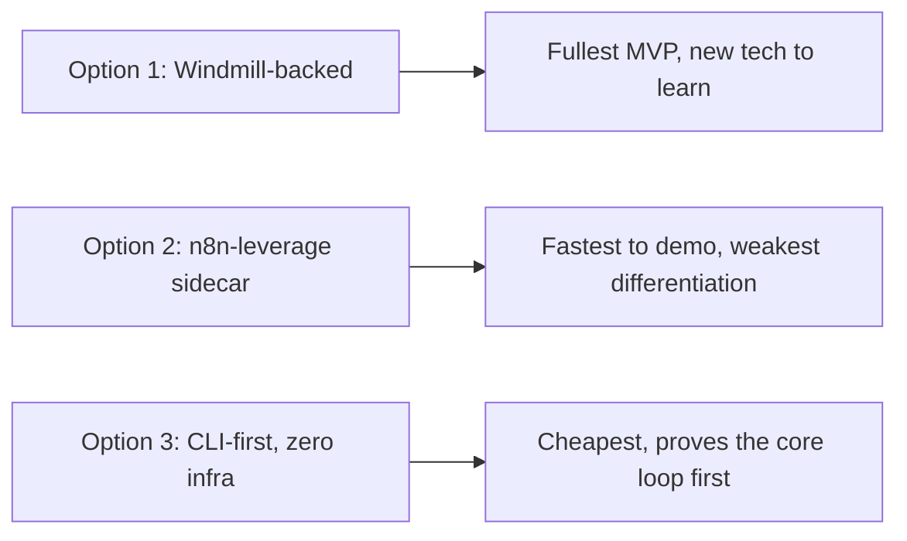

# Operon - Implementation Options

## Summary

Three cheap, primarily-free build paths for Operon, ordered from most-leverages-existing-skill to most-minimal. All three assume [[Operon - Competitive Research]]'s conclusion: own a small versioned workflow IR, don't bet the architecture on n8n/Zapier/Make's schema.

## Option 1 — Windmill-backed MVP (recommended)

- **Scope**: Full described loop — describe → parse to IR → plan → generate Windmill script/flow → validate → deploy → execute → record.
- **Architecture**: Python/FastAPI planner service using LangGraph for the parse→plan→validate state machine; compiles the IR into a Windmill script (Python or TypeScript).
- **Workflow engine**: Self-hosted Windmill (Docker Compose), free, dual-licensed open core.
- **AI layer**: LangGraph + an LLM (Ollama locally for $0, or a cheap API for quality — see [[Operon - Technology Stacks]]).
- **Data layer**: Supabase/Postgres (free tier) for the IR/spec store and execution history.
- **Deployment**: Local machine or a free-tier VPS (Oracle Cloud Free Tier, Fly.io free tier) running Docker Compose.
- **Cost**: $0 recurring with local LLM; a few dollars/month if using a cheap cloud LLM API at personal volume.
- **Local vs. cloud**: Fully local-capable; cloud LLM is an explicit choice, not a requirement.
- **What needs to be built**: the IR schema, the parser/planner, the IR→Windmill compiler, the validation pass, the execution-logging dashboard.
- **What can be reused**: Windmill itself (don't build an execution engine), Supabase (already a known tool), LangGraph (don't build agent orchestration from scratch).
- **Advantages**: Matches the research-validated architecture directly; code-first output is inspectable/git-diffable; genuinely differentiated from every closed-SaaS competitor surveyed.
- **Disadvantages**: Windmill and LangGraph are both new tools — real learning curve (though the builder is a quick study and this is explicitly a learning goal).
- **Risks**: Windmill is a fast-moving young project — API/schema changes are plausible and should be tracked; LLM-generated code correctness needs the validation pass to actually catch errors, not just check schema shape.

## Option 2 — n8n-leverage sidecar

- **Scope**: Same IR/parser/planner core, but the compiler target is n8n workflow JSON instead of Windmill, deployed into a self-hosted n8n instance via its REST API.
- **Architecture**: Same Python/LangGraph planner service; IR→n8n-JSON compiler instead of IR→Windmill.
- **Workflow engine**: Self-hosted n8n (free for personal/internal use under the Sustainable Use License).
- **AI layer**: Same as Option 1.
- **Data layer**: n8n's own Postgres backend plus a lightweight Supabase table for IR versioning/history.
- **Deployment**: Self-hosted n8n via Docker, same free-tier hosting options as Option 1.
- **Cost**: $0–a few dollars/month, same profile as Option 1.
- **Local vs. cloud**: Fully local-capable.
- **What needs to be built**: Same IR/parser/planner/validation layer as Option 1, plus the n8n-JSON compiler instead of the Windmill one.
- **What can be reused**: n8n itself, and directly the builder's own existing n8n expertise — this is the fastest path to a working demo since n8n is both the target and a tool already deeply known.
- **Advantages**: Lowest learning-curve option; fastest to a working demo; n8n's mature node ecosystem covers a lot of real-world integrations Windmill doesn't have pre-built.
- **Disadvantages**: Weakest differentiation of the three — n8n's own native AI Workflow Builder already does "describe it, get an n8n workflow," so Operon adds less on top of this target than on Windmill; Sustainable Use License blocks reselling hosted execution if a SaaS layer is ever pursued commercially.
- **Risks**: Building on a target that already does your core feature natively is a real strategic risk — worth treating this option as a fast prototyping path to validate the parser/planner, not the final architecture.

## Option 3 — CLI-first, zero infra (cheapest, prove-the-loop-first)

- **Scope**: Skip a hosted execution engine entirely for v0. NL description → IR → a standalone generated Python script (using Python + APIs directly) that the user runs manually or schedules via cron/Windows Task Scheduler.
- **Architecture**: A local Python CLI tool; LLM call with structured output (Pydantic schema) produces the IR; a template/codegen step turns the IR into a runnable script.
- **Workflow engine**: None — this option deliberately has no execution engine, just generated code.
- **AI layer**: Direct LLM API calls (or Ollama) with structured output; no LangGraph needed yet since there's no multi-step state machine to manage.
- **Data layer**: Flat files/SQLite, or — a nice synergy — the existing Obsidian vault itself (markdown + YAML) as the spec store, consistent with the Mnemos/MindME philosophy already established in this vault.
- **Deployment**: A local Python CLI; optionally wrapped in a simple Tauri shell later.
- **Cost**: $0 recurring, genuinely — no hosting, no execution engine, no database service.
- **Local vs. cloud**: Fully local, cloud LLM is opt-in only.
- **What needs to be built**: The IR schema, the parser, and a code-generation/templating layer for a narrow set of process patterns.
- **What can be reused**: Nothing beyond the LLM API/Ollama itself — this is the leanest possible build.
- **Advantages**: Fastest to validate whether the core NL→structured-process idea is even useful, before investing in execution-engine integration at all; genuinely zero cost; lowest risk of over-building before the core loop is proven.
- **Disadvantages**: No "deployed workflow that runs on a schedule automatically" experience — closer to a code-generation assistant than an operations platform at this stage; doesn't demonstrate the full described loop (deploy/monitor/optimize) the brief asks for.
- **Risks**: Risk of stalling here and never adding real execution/deployment — needs to be treated explicitly as a throwaway or upgrade-path prototype, not the final product.

## My Take

Option 3 is the right *starting* move regardless of which option becomes the real MVP — it's the cheapest possible way to test whether the parser/planner can reliably turn the builder's own real automations (Travel Desk, alumni workflows) into a sane structured spec, before committing to Windmill's or n8n's deployment model. Option 1 is the right *destination* given the competitive research. Option 2 is worth keeping as a fast fallback specifically because it leverages the strongest existing skill directly, but shouldn't be mistaken for the differentiated version of Operon.

## Related

- [[Operon - Competitive Research]]
- [[Operon - Technology Stacks]]
- [[Operon - Brief]]
