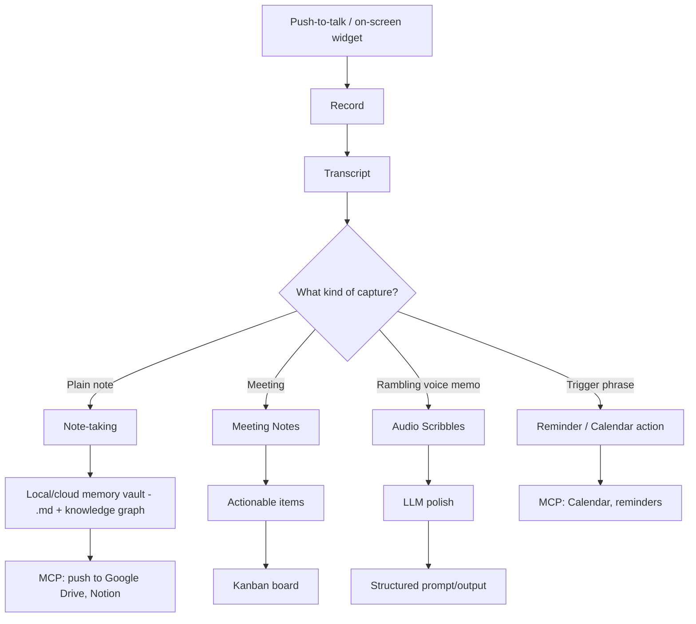

# Relay

## What it is

Relay is a **hybrid (local + cloud)** AI voice and memory assistant — a sibling concept to [[App Scope|Mnemos]], which stays deliberately local-only. Where Mnemos's whole premise is "nothing leaves your machine," Relay's premise is **"local by default, cloud when it earns its keep"** — cloud LLM/STT/sync is an explicit, swappable choice for quality or convenience, never a silent requirement.

The core differentiator from a plain dictation tool: Relay doesn't stop at "voice became text." It turns captured voice into **structured, actionable system state** — a Kanban card, a calendar event, a reminder, a polished document — with as little manual re-entry as possible.

## Structure

## Feature set

- **Note-taking via STT** — the baseline capture mode.
- **Meeting Notes → Kanban** — a meeting transcript gets parsed into actionable items and lands on a lightweight Kanban board, not just a summary. Meeting-notes tool doubles as a minimal PM tool.
- **Audio Scribbles → Structured Prompts** — a rambling, unstructured voice memo gets turned into a structured prompt/output template, not just cleaned-up prose.
- **Local +/cloud memory vault** — Obsidian-style `.md` storage as the source of truth (same principle as Mnemos), with knowledge-graph indexing specifically aimed at cutting retrieval cost (fewer/cheaper embedding calls at query time), and an optional cloud sync layer.
- **Push-to-talk + on-screen widget** — a toggleable capture affordance, in the spirit of Whispering/Handy/VoiceInk.
- **Record → transcript → LLM-polish pipeline** — raw STT output gets cleaned into polished, readable output before it's stored or acted on.
- **MCP connections** — push data out (Google Drive, Notion), pull data in (calendar).
- **Trigger-word reminders and actions** — saying "set a reminder" or "schedule a meeting on Google Calendar" directly triggers that action rather than just getting transcribed as text.
- **Target platform**: Windows desktop, packaged as Electron or Tauri once the core loop is proven.

## Positioning relative to what already exists

The closest direct competitor found in research is **OpenWhispr** (dictation + meeting transcription/diarization + an "AI agent" mode, hybrid local/cloud, MIT core + paid cloud tier) — see [[Relay - Competitive Research]] for the full landscape and exactly where Relay's meeting-to-Kanban and audio-scribbles features would need to differentiate from it.

## Related notes

- [[Relay - Competitive Research]] — the repo/product landscape and where Relay fits
- [[Relay - Implementation Options]] — 3 cheap build paths
- [[Relay - Technology Stacks]] — 3 candidate stacks
- [[Relay - MVP and Recommendation]] — MVP scope, cost matrix, USPs, final recommendation

## Related

- [[App Scope]]
- [[App Ideas]]
- [[AI and LLM Technology]]
