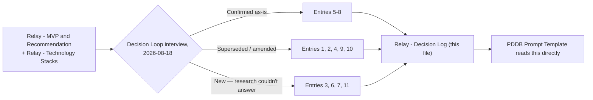

# Relay - Decision Log

## Summary

The confirmed decision record for Relay, produced by [[Decision Loop]]'s interview on 2026-08-18 since no such log existed yet. It carries forward every decision [[Relay - MVP and Recommendation]] and [[Relay - Technology Stacks]] already settled through research, and adds the decisions only the builder could make — build environment, repo relationship, and a few scope changes that came out of the interview itself. [[PDDB Prompt Template]] reads this file directly rather than re-deriving decisions from research on every future run.

---

## How to read this

Entries 1, 2, 4, 9, and 10 **supersede or amend** an equivalent call in [[Relay - MVP and Recommendation]] or [[Relay - Technology Stacks]] — each says so explicitly in its Context. Entries 5–8 carry the original research decisions forward **unchanged**. Entries 3, 6, 7, and 11 are new — they didn't exist as decisions until this interview, because nothing in the research could have answered them.

## Decisions

**1. Build path & relationship to Mnemos** — *supersedes the original research*
Context: [[Relay - MVP and Recommendation]] originally recommended Option 2 — extending Mnemos's existing stack directly — for the cleanest architectural fit and maximum code reuse, over forking Meetily (Option 1, fast but a real Rust learning curve) or an n8n-orchestrated shell (Option 3, fast given existing n8n fluency but a two-system packaging cost).
Decision made: Build Relay from scratch in a brand-new repository. Do not extend or copy code from Mnemos's existing codebase, and do not fork Meetily's repo either.
Reason: Explicit call made during the Decision Loop interview — Relay is to be its own independent project. Tech-stack choices may still be inspired by Mnemos or Meetily; the code itself is not.
Alternatives considered: Extending Mnemos directly (the original research pick) — no longer wanted. Forking Meetily wholesale — ruled out by the same "no seeding" call.
Impact: No files are copied from Mnemos or Meetily into Relay. `/docs` and setup instructions must assume a genuinely empty starting repo, not a "clone and extend" flow.

**2. Technology stack** — *supersedes the original research*
Context: [[Relay - Technology Stacks]] defined three options (Stack A: Meetily-forked Rust core; Stack B: Mnemos-native Python extension; Stack C: n8n-orchestrated) and recommended Stack B. Decision 1 above rules out both a Meetily fork and a Mnemos extension. A capability check against `Profile/` (Python: seedling/developing; Rust: not a listed skill; n8n: intermediate–advanced with real production usage; Web/Next.js: intermediate, "product-builder level, not deep frontend engineering") pointed toward an n8n-orchestrated approach as the best capability fit.
Decision made: A from-scratch Rust backend + Tauri/React native shell for Windows — Parakeet/Whisper for local STT, Piper for local TTS, Ollama with a hybrid cloud-LLM toggle, LanceDB as the embedded vector store. Architecturally closest to the original research's Stack A, but built independently rather than forked from Meetily. A Next.js web frontend, cloned from [[Starter Template]], serves the hybrid/cloud-mode web surface (see Decision 3).
Reason: Explicit choice made during the interview, made in full knowledge that it overrides the capability-based recommendation to use n8n — a deliberate choice for closer alignment with Meetily's transcription-pipeline performance over the lower-learning-curve option.
Alternatives considered: n8n-orchestrated backend (best capability fit per `Profile/`, not chosen). Python/FastAPI built fresh (lower learning-curve risk than Rust, not chosen).
Impact: A real Rust learning curve is accepted as a known, deliberate tradeoff, not an oversight — flag this explicitly in any generated build prompt rather than treating it as a risk to warn about. The web hybrid surface is new scope beyond anything in the original three-stack comparison, none of which included a web frontend at all.

**3. Hybrid deployment now includes a web surface** — *new*
Context: Every prior Relay research note assumed a single Windows desktop app as the only deployment target; "hybrid" described a local/cloud provider toggle, never a second client surface.
Decision made: Local deployment stays native Windows (Tauri). Hybrid/cloud mode must also be reachable via a web client, not just the desktop app.
Reason: Explicit constraint given during the interview.
Alternatives considered: Desktop-only hybrid (the original assumption) — no longer sufficient.
Impact: The Rust backend must expose an API consumable by both the native shell and a separate web frontend, not just serve one embedded client. Adds a new milestone: a Next.js web dashboard built from [[Starter Template]].

**4. Cost ceiling is a hard constraint** — *amends the original research*
Context: [[Relay - MVP and Recommendation]] already targeted $0 recurring cost as the default, framing cloud options as "explicit, swappable, optional."
Decision made: Zero budget is a hard constraint, not a soft default. Free/local must always be the working fallback; any paid option must degrade gracefully to fully free operation, never require payment to function.
Reason: Explicit constraint from the interview ("cost always consider i am broke as shit").
Alternatives considered: Treating cloud options as "nice to have, slightly paid is fine" — rejected outright.
Impact: Every optional cloud feature (hybrid LLM, cloud sync) must ship fully functional at $0 before any paid tier is even wired in as a toggle.

**5. No meeting-bot architecture** — *carried forward unchanged*
Context: Every commercial meeting-notes competitor surveyed (Fireflies, Otter, Fathom, tl;dv, Read.ai) joins the call as a bot; this category carries active legal risk (Fireflies' unresolved BIPA lawsuits) and platform risk (Teams/Zoom/Meet all tightening bot restrictions in 2026).
Decision made: Relay captures only via push-to-talk/local audio; it never joins a call as a bot.
Reason: Sidesteps the platform-detection arms race and category-wide legal exposure structurally, not just as a privacy preference.
Alternatives considered: A Vexa-style self-hosted meeting bot — self-hosting mitigates privacy concerns but not the platform-detection risk itself.
Impact: Relay cannot passively capture a meeting the user isn't actively present at with the widget running — an accepted, deliberate tradeoff.

**6. Retrieval architecture** — *carried forward unchanged*
Context: Graph-based retrieval (GraphRAG-style) reduces query-time cost but is expensive to build and only pays off above roughly 1K documents; Microsoft's own GraphRAG costs ~$33K to index a large corpus.
Decision made: Ship plain LanceDB vector RAG for the MVP; no graph-based retrieval layer yet.
Reason: Below ~1K documents, plain vector RAG wins on cost/complexity — a personal vault at MVP stage is well under that threshold.
Alternatives considered: LightRAG (HKUDS), a cheaper incremental graph option — explicitly deferred to a later optimization pass, not rejected outright.
Impact: Retrieval-cost optimization stays a "Later" tier item, not an MVP requirement.

**7. Kanban delivery scope for MVP** — *carried forward unchanged*
Context: No meeting tool surveyed produces an actual board, only an action-item list — making transcript-to-Kanban Relay's genuine whitespace feature, but its parsing quality is unvalidated.
Decision made: MVP ships a local list-to-board Kanban view (read from the markdown vault), not a full drag-and-drop, persisted board.
Reason: Validate meeting→Kanban parsing quality before investing in board UI/persistence engineering.
Alternatives considered: Building a full custom Kanban app immediately — rejected as premature investment ahead of the harder, unproven part.
Impact: MVP UI surface for Kanban stays intentionally minimal; drag-and-drop persistence remains explicitly Post-MVP.

**8. MCP integrations** — *carried forward unchanged*
Context: Calendar, Notion, and Google Drive all already have usable community or official MCP servers.
Decision made: Reuse `nspady/google-calendar-mcp`, `makenotion/notion-mcp-server`, and `isaacphi/mcp-gdrive` (or `piotr-agier/google-drive-mcp`) rather than building custom integrations.
Reason: All three are already usable as-is; custom integrations would be pure reinvention.
Alternatives considered: None seriously considered.
Impact: Integration work for these three services is wiring/config, not new protocol implementation.

**9. No Rust-vs-Python benchmarking spike** — *resolves an open item from the original research*
Context: [[Relay - Technology Stacks]] suggested a short spike benchmarking Meetily's Rust/Parakeet transcription speed against a Python/Whisper equivalent before committing to a backend language.
Decision made: Skip the spike — go directly to a Rust backend.
Reason: Decision 2 already commits to Rust directly; no Python path was chosen, so there's nothing left to benchmark against.
Alternatives considered: Running the spike anyway for data — unnecessary once the language choice was made directly.
Impact: No benchmarking milestone is needed before development starts.

**10. Trigger phrases are user-customizable** — *amends the original MVP scope*
Context: [[Relay - MVP and Recommendation]] scoped Milestone 6 as wiring up "a small, fixed set" of trigger phrases, naming only two examples ("set a reminder," "schedule X on calendar") and never enumerating a full list.
Decision made: Trigger phrases and their mapped actions must be user-configurable within the app, not hardcoded.
Reason: Explicit choice made during the interview.
Alternatives considered: A small fixed hardcoded set (the original scope) — rejected in favor of configurability.
Impact: Milestone 6 expands from "wire up a fixed detector" to "build a config-driven trigger-phrase system" — a settings surface (native app and/or web dashboard) for defining phrase→action mappings, plus an intent classifier that reads from that config instead of a hardcoded list. This is a real scope increase over the original MVP definition and should be called out as such wherever Milestone 6 is referenced.

**11. Target build environment** — *new*
Context: A generated build prompt needs to know which IDE/AI assistant will execute it, since tool availability and conventions vary by IDE.
Decision made: Google Antigravity is the IDE/AI assistant building Relay.
Reason: Stated directly during the interview.
Alternatives considered: None — a direct answer to a fixed build-environment question.
Impact: Generated prompts should stay IDE-agnostic in their instructions where possible, but should name Google Antigravity as the actual execution environment for context.

## My Take

The most useful thing this interview surfaced wasn't any single answer — it's that Decision 2 was made in direct, acknowledged tension with Decision 6's own capability data (n8n is the advanced, production-proven skill; Rust isn't a listed skill at all). Recording that tension explicitly, rather than quietly picking whichever stack "sounds more legitimate," is exactly what a decision log is supposed to make visible for a future re-read.

## Related

- [[Relay - Brief]]
- [[Relay - MVP and Recommendation]]
- [[Relay - Technology Stacks]]
- [[Decision Loop]]
