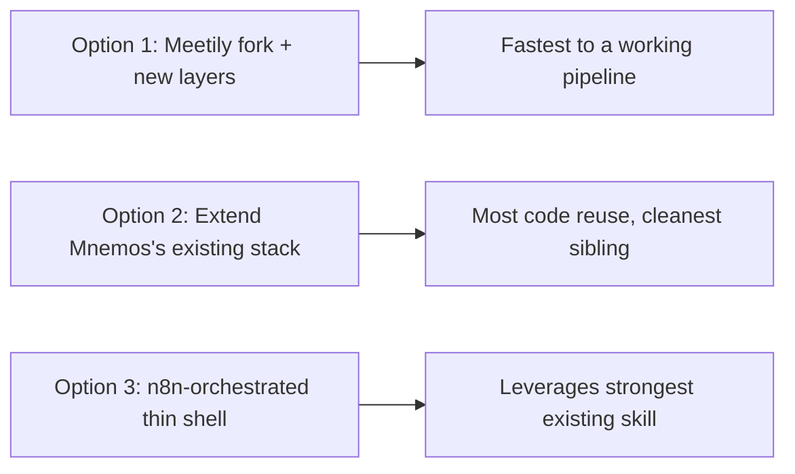

# Relay - Implementation Options

## Summary

Three cheap, primarily-free build paths, ordered by how much validated open-source code each one reuses versus builds from scratch.

## Option 1 — Fork/study Meetily as the pipeline core

- **Scope**: Use [[Relay - Competitive Research]]'s top open-source find — Meetily (MIT) — as the transcription/LLM-polish backbone, then add Relay-specific layers: meeting→Kanban parsing, audio-scribble→structured-prompt generation, MCP integrations, trigger-word action detection.
- **Architecture**: Meetily's Rust backend + Next.js frontend handle capture/transcription/polish; new services layer on top for Kanban generation and trigger-word intent detection.
- **Tech**: Rust, Next.js/TypeScript, Parakeet/Whisper STT, Ollama/Claude/Groq/OpenRouter (Meetily's existing provider abstraction).
- **AI layer**: Reuse Meetily's provider-swap pattern directly; add prompt templates for Kanban-card extraction and structured-prompt generation.
- **Data layer**: LanceDB for the memory vault (matches Mnemos), Meetily's existing local storage for raw transcripts.
- **Deployment**: Desktop app, Tauri or Meetily's existing packaging.
- **Cost**: $0 recurring with local Whisper/Ollama; a few dollars/month if using Groq/cloud LLM for quality.
- **Local vs. cloud**: Fully local-capable by default, matching Meetily's own design.
- **What needs to be built**: Kanban parser/UI, structured-prompt generator, MCP integrations (Calendar/Drive/Notion), trigger-word detection, on-screen widget.
- **What can be reused**: Meetily's entire STT/LLM-provider/transcription pipeline (MIT license permits direct forking or code-borrowing).
- **Advantages**: Fastest path to a working, validated transcription pipeline — skips rebuilding STT/provider-abstraction work that's already solved well.
- **Disadvantages**: Rust is not a current strength (see [[Technical Skills & Technology Stack]]) — real learning curve to meaningfully modify Meetily's backend rather than just running it as-is.
- **Risks**: Depending on a young, single-repo project (~29k★ but still one primary codebase) for the core pipeline — worth pinning a specific version and tracking upstream changes.

## Option 2 — Extend Mnemos's existing stack directly

- **Scope**: Relay as a genuine sibling/extension of Mnemos, reusing its already-built Whisper/Piper/Ollama/LanceDB/Tauri/MCP-connector foundation, adding new modules on top: meeting→Kanban, audio-scribble→structured-prompt, trigger-word actions, and a hybrid cloud toggle Mnemos itself doesn't have.
- **Architecture**: Python backend (matches Mnemos's `backend.cli` pattern) + Tauri shell (already built for Mnemos) + new prompt-template modules for Kanban/structured-prompt generation + a hybrid provider layer (Ollama or cloud LLM/STT, swappable).
- **Tech**: Python, FastAPI (Mnemos's existing pattern), Whisper, Piper, Ollama, LanceDB, Tauri/React.
- **AI layer**: LLM prompt templates for meeting-parsing and structured-prompt generation; a lightweight intent-classification prompt for trigger-word detection.
- **Data layer**: LanceDB (already Mnemos's choice) plus the Obsidian-style markdown vault as source of truth.
- **Deployment**: Tauri desktop app, directly reusing Mnemos's existing shell/build setup.
- **Cost**: $0 recurring locally; hybrid cloud adds a few dollars/month only when explicitly enabled.
- **Local vs. cloud**: Local by default (Mnemos's philosophy), cloud as an explicit opt-in per component (STT, LLM, sync) — this is what makes it genuinely hybrid rather than local-only.
- **What needs to be built**: Kanban module, structured-prompt module, trigger-word/MCP-action layer, the hybrid cloud toggle itself, on-screen widget.
- **What can be reused**: Nearly all of Mnemos's existing backend, shell, and MCP-connector pattern — the most code reuse of the three options, since it's reusing the builder's own prior work rather than a third party's.
- **Advantages**: Cleanest architectural fit as a true Mnemos sibling; no new language to learn (Python is already the builder's growing skill, not a cold start like Rust); directly extends validated, already-working code.
- **Disadvantages**: Slower initial pipeline-quality bar than Option 1, since Meetily's Rust/Parakeet stack may outperform a from-scratch Python equivalent on raw transcription speed.
- **Risks**: Coupling Relay too tightly to Mnemos's codebase could complicate keeping the two projects' diverging philosophies (hybrid vs. local-only) cleanly separated over time.

## Option 3 — n8n-orchestrated, thin native shell

- **Scope**: A minimal Tauri/Electron capture app (push-to-talk + on-screen widget + local Whisper) posts transcripts to a self-hosted n8n instance via webhook; n8n handles LLM structuring, Kanban card creation, calendar/reminder actions, and memory-vault writes.
- **Architecture**: Thin native shell for capture only; n8n as the actual orchestration/workflow engine.
- **Tech**: Tauri (or Electron) + local Whisper for capture; self-hosted n8n for everything downstream — LLM nodes, Notion/Trello API nodes for Kanban cards, Google Calendar node for scheduling, a markdown-file-write node for the vault.
- **AI layer**: n8n's LLM/AI nodes (Ollama or cloud LLM node) for structuring and intent detection.
- **Data layer**: n8n's own storage plus the markdown vault; LanceDB added only if/when retrieval becomes a real need.
- **Deployment**: Self-hosted n8n (Docker, free), thin native shell distributed separately.
- **Cost**: $0 recurring with local Ollama node; a few dollars/month with a cloud LLM node.
- **Local vs. cloud**: Local-capable, same hybrid flexibility as the other options via n8n's node choice.
- **What needs to be built**: The thin capture shell, and the n8n workflow itself (structuring, Kanban push, calendar/reminder actions, vault write).
- **What can be reused**: n8n itself and the builder's own deep n8n expertise ([[n8n]]) — directly reuses the single strongest skill in the whole profile; Notion/Google Calendar/Drive nodes or MCP servers instead of custom integration code.
- **Advantages**: Lowest custom-code option of the three; fastest to a working automation given existing n8n fluency; easiest to iterate on the Kanban/action logic visually rather than in code.
- **Disadvantages**: Splits Relay across two systems (a native shell plus an n8n instance) rather than one cohesive app — a real packaging/distribution complication if Relay is ever meant to be a single installable Windows app.
- **Risks**: n8n-as-backend makes eventual Electron/Tauri packaging of the *whole* experience harder, since n8n itself isn't meant to be embedded inside a desktop app.

## My Take

Option 2 is the right long-term direction — it's the only one that treats Relay as a genuine sibling to Mnemos rather than a fresh build or an n8n-dependent hybrid, and it reuses the builder's own prior work rather than someone else's repo or a visual tool that resists final packaging. Option 3 is worth prototyping first specifically because it's the fastest way to validate the Kanban/trigger-word logic using pure n8n fluency, before committing to writing that logic in Python for Option 2.

## Related

- [[Relay - Competitive Research]]
- [[Relay - Technology Stacks]]
- [[Relay - Brief]]
