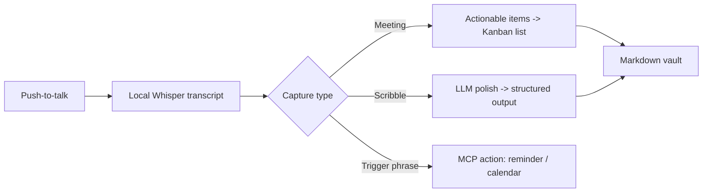

# Relay - MVP and Recommendation

## MVP definition (~50–60% usability)

Push-to-talk records a note or meeting locally. Meeting-type captures get parsed into actionable items placed on a simple local Kanban board (list-to-board, not a full drag/drop app yet). Quick voice notes ("audio scribbles") get turned into a polished, structured output. Everything saves to a local Obsidian-style markdown vault. A small, fixed set of trigger phrases ("set a reminder", "schedule X on calendar") directly call the relevant action via MCP, instead of just being transcribed.

Explicitly deferred from MVP: cloud sync, Notion/Drive push, on-screen widget polish, full drag-and-drop Kanban, knowledge-graph retrieval optimization.

## Tiers

| Tier | Scope |
|---|---|
| **MVP** | Push-to-talk capture, local Whisper transcription, meeting→Kanban-list parsing, scribble→structured-output polish, markdown vault storage, a fixed trigger-phrase set for Calendar/reminder actions |
| **Post-MVP** | Cloud sync toggle, Notion/Google Drive push via MCP, a real drag-and-drop Kanban board with persistence, on-screen widget UI, a structured-prompt template library |
| **Later** | LightRAG-style incremental knowledge graph for retrieval-cost reduction, expanded trigger-word vocabulary, TTS voice-feedback confirmations, a proper installer for distribution |
| **Experimental** | Full GraphRAG, cross-device sync, a mobile companion, shared/team vault features |

## Free / open source / paid matrix

| Component | Classification | Note |
|---|---|---|
| Whisper (STT) | Free, local | Already Mnemos's pattern |
| Piper (TTS) | Free, local | Same |
| Ollama (LLM) | Free, local | Zero-cost default |
| Cloud LLM (optional) | Cheap paid | GPT-4o-mini/Gemini Flash/Claude Haiku — a few dollars/month at personal volume |
| LanceDB | Free, embedded | No hosting cost |
| MCP servers (Calendar/Notion/Drive) | Free, community/official | None need building |
| Supabase (if cloud sync added) | Free tier | Watch the auto-pause-after-idle-week behavior |
| Tauri | Free, open source | Packaging |

**The MVP can run at $0 recurring cost** entirely locally, exactly like Mnemos — the hybrid cloud option is an explicit, optional upgrade for quality or convenience, never a requirement.

## USPs (5)

1. **Transcript-to-Kanban is genuine whitespace** — every meeting tool surveyed, commercial or open-source, stops at an action-item list; none produce an actual board.
2. **Audio-scribble-to-structured-prompt is a distinct, unaddressed feature** — different from the generic voice-to-text cleanup every dictation tool already does.
3. **Bot-free, local-audio-capture design** sidesteps the entire Teams/Zoom/Meet anti-bot enforcement risk and the category-wide legal exposure (Fireflies' active BIPA lawsuits) that every bot-based commercial competitor carries — a structural safety advantage, not just a privacy preference.
4. **Trigger-word direct action execution** (not transcribe-then-review) turns capture into action in one step — the same automation-first instinct behind [[n8n]] and [[Google Apps Script]], applied to voice.
5. **Genuinely hybrid by design** — not cloud-first with a token local mode, and not local-only like Mnemos — every layer (STT, LLM, sync) is independently swappable, letting cost and privacy trade off deliberately rather than being baked in.

## Final Recommendation

**What Relay should be**: a hybrid local/cloud voice assistant whose core value is turning captured voice into structured, actionable system state — a Kanban card, a calendar event, a polished document — not another dictation tool or another meeting summarizer.

**Who it should initially serve**: the builder themselves, as a Mnemos sibling for a workflow that's meeting- and task-heavy rather than pure knowledge-capture.

**Core problem**: closing the gap between "I said something" and "something useful happened," without a manual re-entry step in between.

**Core workflow**: push-to-talk → transcript → (Kanban / structured output / direct action) → vault (see the MVP diagram above).

**Recommended architecture**: extend Mnemos's existing local-first stack rather than starting fresh or depending on a third-party repo, with a genuinely hybrid provider layer added on top.

**Recommended stack**: Stack B from [[Relay - Technology Stacks]] — Tauri + Python/FastAPI + Whisper + Piper + Ollama/hybrid LLM + LanceDB + markdown vault.

**Recommended MVP**: the push-to-talk → Kanban-list / structured-output / trigger-action loop defined above.

**What to build**: the meeting→Kanban parser, the scribble→structured-output prompt templates, the trigger-word intent detector, the hybrid local/cloud provider toggle.

**What to reuse**: Mnemos's existing Whisper/Piper/Ollama/LanceDB/Tauri stack, and the three already-available MCP servers for Calendar/Notion/Drive.

**What NOT to build**: a meeting-bot architecture (real legal/platform risk, see [[Relay - Competitive Research]]), full GraphRAG on day one, a fully custom Kanban app before validating the parsing logic works.

**Open-source strategy**: fully open-sourceable, same as Mnemos — nothing in the MVP requires a proprietary dependency, and the hybrid cloud option stays user-configurable rather than gated.

**Biggest technical risks**: meeting→Kanban parsing quality (does the LLM reliably extract genuine action items vs. noise) and trigger-word false-positive/false-negative rates in natural speech — both need real usage testing, not just prompt design.

**Biggest product risks**: scope creep into a full PM tool (Kanban should stay a byproduct of capture, not become a competing feature surface against dedicated PM tools) and into a full meeting-bot product (which would reintroduce the exact platform/legal risk this design avoids).

**Competitive differentiation**: see the USPs above — the throughline is that Relay closes the capture-to-action loop in ways nothing surveyed does, while sidestepping the bot-based category's structural legal exposure entirely.

### First 10 development milestones

1. Add a hybrid LLM/STT provider toggle to Mnemos's existing backend (local Ollama/Whisper vs. a cheap cloud API), config-driven, no UI yet.
2. Build the push-to-talk + on-screen widget capture UI in the existing Tauri shell.
3. Build the meeting→Kanban-list parser: a prompt template that extracts actionable items from a transcript into a structured list.
4. Build a minimal local Kanban view (list-to-board, read from the same markdown vault) — no drag/drop yet.
5. Build the audio-scribble→structured-output prompt templates and wire them to a second capture mode.
6. Wire up the fixed trigger-phrase detector (a lightweight intent-classification prompt) for "set a reminder" and "schedule on calendar."
7. Integrate `nspady/google-calendar-mcp` for the calendar-scheduling trigger action.
8. Add a local reminder mechanism (OS-level notification or a simple scheduled-task write) for the reminder trigger action.
9. Dogfood: use Relay for a week of real meetings and voice notes, tracking parsing accuracy for both the Kanban and structured-output paths.
10. Based on dogfooding results, prioritize either Notion/Drive push (post-MVP) or drag-and-drop Kanban persistence as the next milestone.

## My Take

The dogfooding milestone (#9) matters more than any single feature here — meeting→Kanban parsing quality is the one thing that can't be validated by reading competitor reviews, only by actually using it on real meetings and seeing whether the extracted action items are the ones a person would have written down themselves.

## Related

- [[Relay - Technology Stacks]]
- [[Relay - Competitive Research]]
- [[Relay - Brief]]
