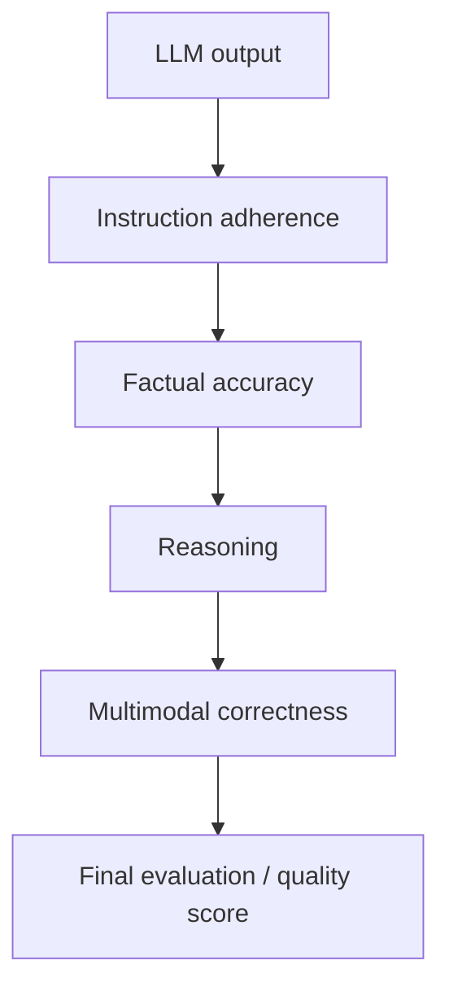

# AI and LLM Technology

## Summary

This is one of my strongest technical domains — **Advanced**, operational capability. My experience isn't "using ChatGPT," it's real, hands-on experience with LLM evaluation and AI quality operations.

## Core capabilities

Generative AI, LLM evaluation, response evaluation, factuality, reasoning, instruction adherence, multimodal evaluation, educational dataset evaluation, AI quality assurance, AI operations.

## Evaluation framework I've worked with

## Roles and operational experience

I've worked as an **AI Quality Assurance / Pod Lead — LLM Evaluation** and as an **AI Evaluator — LLM Response Evaluation**, with experience around enterprise-scale LLM evaluation programs. I've also designed reviewer SOPs, evaluation frameworks, onboarding systems, quality-control mechanisms, reviewer workflows, and multimodal evaluation processes — i.e. the operations layer around evaluation, not just doing the evaluations myself.

## Where this connects to my other work

AI quality systems, evaluation pipelines, human-in-the-loop AI, AI operations, AI process automation, and AI-assisted workflows are all places where this evaluation background meets my [[Automation & Workflow Engineering]] and [[Data Analytics & BI]] skills directly — evaluating LLM output quality and building the [[Technical Skills & Technology Stack|Mnemos]] project both draw on the same "does this response actually hold up" judgment.

## My Take

This is the one domain in this profile I'd unambiguously call `evergreen` alongside Product & Systems Design — it's been tested at enterprise scale, not just self-assessed. It's also my most direct bridge into the Mnemos project (see [[App Scope]]): building an LLM-grounded assistant and evaluating LLM output quality are the same underlying skill, applied in two directions.

## Related

- [[AI and ML Learning]]
- [[Second Brain - PKM Tools Survey (Aug 2026)]]
- [[Technical Skills & Technology Stack]]
