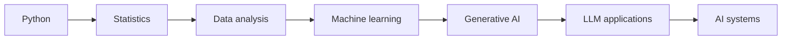

# AI and ML Learning

## Summary

This is my next major technical expansion area — **Developing**. Importantly, it builds directly on capabilities I already have: AI evaluation, data, analytics, Python, and SQL, rather than starting from zero.

## What I'm adding

Machine learning fundamentals, Python for ML, data preparation, model concepts, generative AI, LLM concepts, AI applications, statistical thinking.

## My intended progression

## Why this combination, specifically

The direction I'm building toward combines **AI + Analytics + SQL + Python + Operations + Product** — rather than treating AI/ML as an isolated technical specialization disconnected from the operational and product work in [[Product & Systems Design]] and [[Data Analytics & BI]].

## My Take

This is deliberately `seedling`, and it should stay honestly labeled until the Python/SQL foundation in [[Python]] and [[SQL]] is further along — ML concepts without that foundation would just be theory. The reason I'm confident in the direction, even at this stage, is that [[AI and LLM Technology]] already proves I have the evaluation judgment; what's missing is the technical modelling layer underneath it.

## Related

- [[AI and LLM Technology]]
- [[Python]]
- [[Technical Skills & Technology Stack]]
