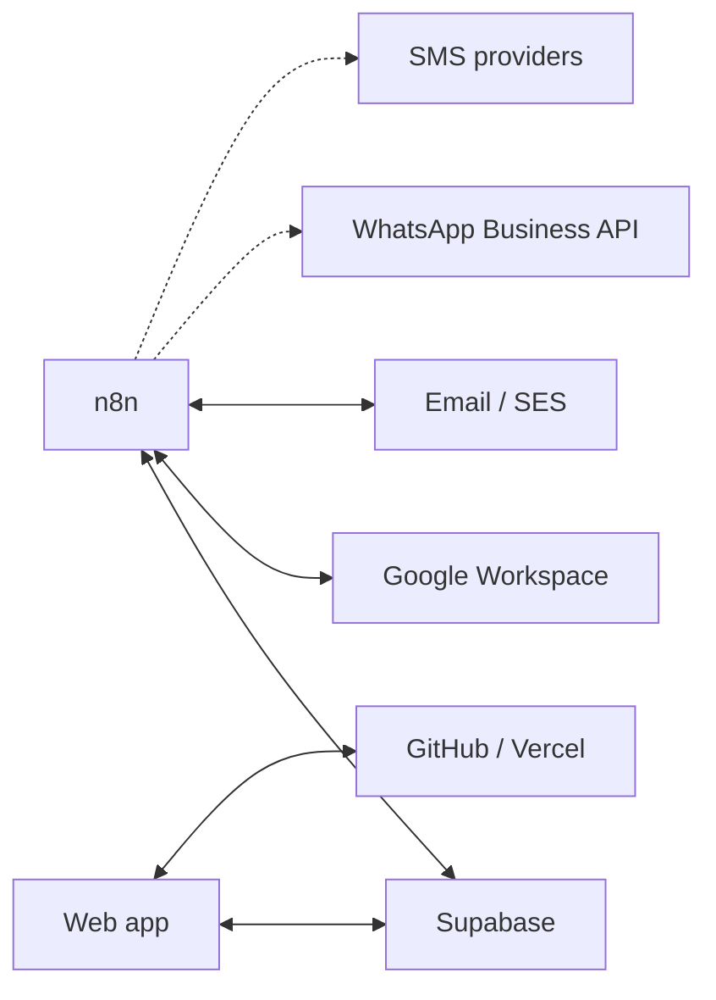

# APIs & Integrations

## Summary

This is the capability underneath all of my automation work — I understand systems as connected components rather than isolated applications. **Intermediate practical** level.

## Core concepts

APIs, REST concepts, webhooks, authentication concepts, request/response flows, data mapping, integration triggers, API-driven automation, system synchronization.

## Systems I've worked around

Supabase, Google Workspace, n8n, GitHub, Vercel, email, Amazon SES, internal applications, WhatsApp Business API, SMS systems.

## My strength

I'm particularly good at asking: **"What system should own this data, and what event should cause another system to act on it?"** — that question is worth more at the systems level than knowing any individual API's syntax.

## My Take

APIs & Integrations is less a standalone skill and more the connective tissue between [[n8n]], [[Databases & Data Architecture]], and [[Web Application & Full-Stack Exposure]] — I don't think of it as "I know REST," I think of it as "I know which system should be the source of truth for this piece of data, and which event should notify the others."

## Related

- [[Automation & Workflow Engineering]]
- [[Web Application & Full-Stack Exposure]]
- [[Technical Skills & Technology Stack]]
