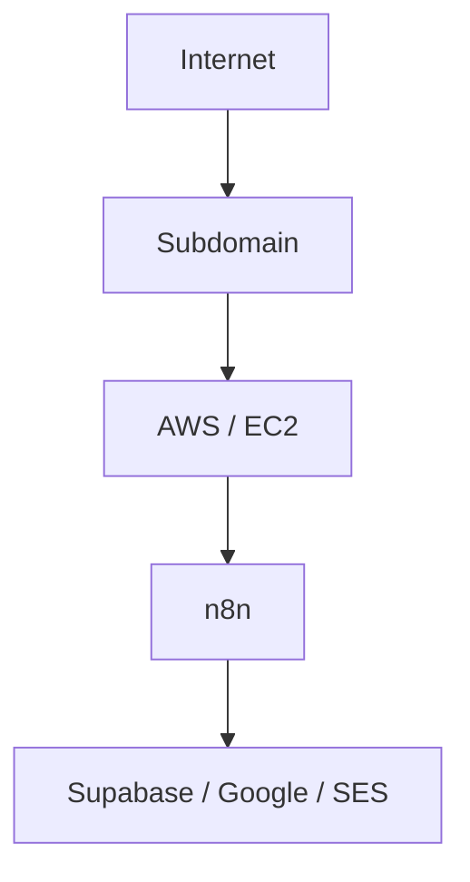

# AWS & Amazon SES

## Summary

My AWS capability is more **architecture and infrastructure literacy** than deep DevOps engineering — **Foundational → Intermediate**, built mainly around hosting automation infrastructure.

## AWS areas

EC2, IAM, DNS, subdomains, server hosting, persistent services, infrastructure planning, cost considerations.

## My main use case: centralized n8n hosting

I understand *why* each layer matters: why persistent hosting is needed for event-driven workflows to stay available, why IAM matters, why DNS/subdomains matter, why SMTP/SES configuration matters, why storage architecture matters, and why infrastructure cost needs to be considered from the start rather than discovered later.

## Amazon SES

A smaller, useful specialization within this: transactional email architecture, SMTP, DNS configuration, sending-volume estimation, cost estimation, domain/subdomain requirements, automated email delivery. I've specifically worked through the economics of roughly **45,000 emails/month** for operational workflows and evaluated SES against alternative providers. **Working practical knowledge.**

## My Take

I've been involved in discussions with DevOps around *defining* infrastructure requirements rather than simply consuming infrastructure as a black box — that's the distinction I'd want understood here: I'm not the person who configures IAM policies day-to-day, but I'm the person who can say "this needs persistent hosting, here's the expected volume, here's why SES over an alternative" and have that hold up.

## Related

- [[n8n]]
- [[Git, GitHub & Vercel]]
- [[Technical Skills & Technology Stack]]
