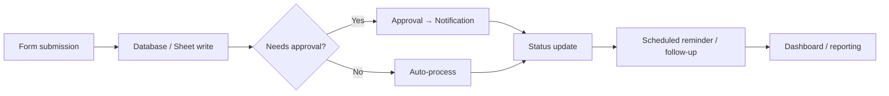

# Automation & Workflow Engineering

## Summary

This is my **Strong / Advanced** capability in turning manual, multi-step business processes into event-driven or scheduled systems — n8n and Google Apps Script are the two tools I use most, but the underlying skill is process automation itself, not either tool specifically.

## Technologies

n8n, Google Apps Script, Google Forms, Google Sheets, Google Workspace, Notion, email automation, webhooks/event-driven workflows, scheduled workflows, API-based integrations.

## Capabilities

Event-driven automation, scheduled automation, form → database workflows, form → Sheets workflows, approval workflows, reminder systems, email notifications, escalation workflows, status-based triggers, automated follow-ups, data synchronization, workflow logging, error/exception handling, automated reporting, multi-step business processes.

## Automation patterns I build repeatedly

I've designed simple chains — **Google Form → Google Sheet → approval → email → reminder → status update → tracker** — and more complex systems: **database → workflow engine → communication → response capture → CRM update → dashboard/reporting**.

## Automation as infrastructure

Once automation stops being "a few workflows" and becomes infrastructure, a different set of questions shows up. I've thought through: AWS-hosted n8n, persistent workflow execution, production vs. development workflows, expected workflow volumes (scaling toward **25–30 production/development workflows**), subdomains, SMTP, Amazon SES, IAM permissions, DNS configuration, Supabase integration, and WhatsApp/SMS integration considerations.

## Operational examples

I've built automation around the NG Travel Desk, Alumni Growth, Pay Forward, and CEO Office workflows — covering reminders, approvals, call logging, and notifications end-to-end. See [[Google Apps Script]] for the Travel Desk walkthrough in detail.

## My Take

The pattern above — form/event → validate → route/approve → act → notify → log → report — is the same shape every time, regardless of which tool implements it. That's the actual skill; n8n and Apps Script are just where I currently express it. See [[n8n]] and [[Google Apps Script]] for the tool-specific depth.

## Related

- [[Technical Skills & Technology Stack]]
- [[n8n]]
- [[Google Apps Script]]
- [[APIs & Integrations]]
