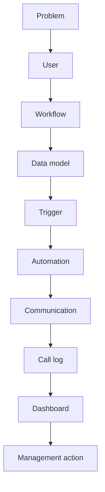
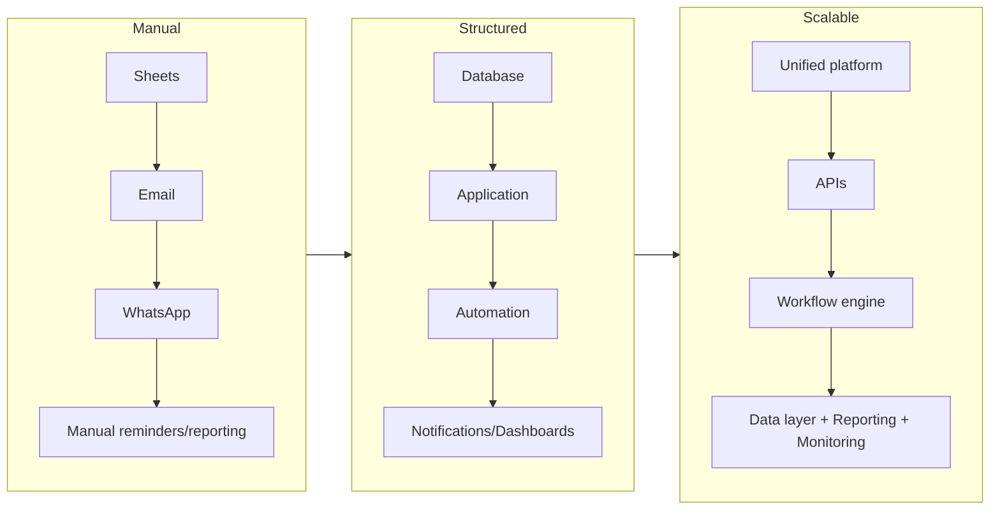

# Business-to-Technology Translation & Digital Transformation

## Summary

This is my core differentiator: I can sit with a business/operations team, understand a problem stated in plain operational language, and translate it all the way down into a working technical system.

## The translation, concretely

Someone says: *"We have a problem with alumni follow-up."* I translate that into:

That's the bridge between **strategy ↔ operations ↔ product ↔ technology** — not many people are equally comfortable across all four, and it's the actual value I add before any tool gets chosen.

## Digital transformation, as a recurring pattern

My work repeatedly follows the same three-stage shape:

This is, in plain terms, operational digitization and automation — not a buzzword, a description of the actual path each system I've built has taken.

## My Take

[[Systems Thinking & Technical Problem-Solving]] is the *cognitive* pattern; this note is the *conversation* that pattern enables — being the person who can hear "alumni follow-up is broken" and already be thinking in terms of triggers and dashboards, without losing the thread back to what the business actually needs.

## Related

- [[Systems Thinking & Technical Problem-Solving]]
- [[Product & Systems Design]]
- [[Technical Skills & Technology Stack]]
