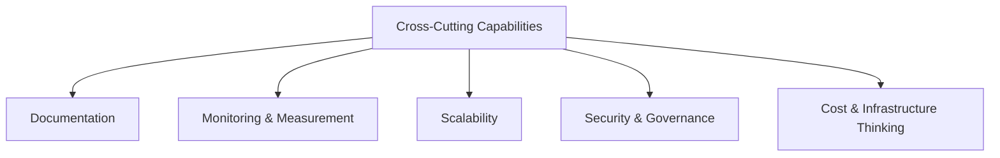

# Cross-Cutting Technical Capabilities

## Summary

A handful of capabilities show up inside almost every note in this profile rather than belonging to one cluster — worth naming on their own so they don't get lost inside [[Product & Systems Design]], [[Automation & Workflow Engineering]], or [[AWS & Amazon SES]].

## Documentation

PRDs, SOPs, technical notes, workflow documentation, architecture documentation — I write the documentation a system needs to be run by someone other than me, not just documentation for its own sake (see the reviewer SOPs in [[AI and LLM Technology]]).

## Monitoring & measurement

KPIs, logs, status tracking, alerts, dashboards — the same instinct from [[Data Analytics & BI]] applied to the health of the system itself, not just its business outcomes.

## Scalability

Workflow volume, data volume, email volume, infrastructure capacity, cost optimization — the questions I ask when something is about to go from "a few workflows" to real production load, as in [[n8n]]'s 25–30 workflow scaling discussion.

## Security & governance

IAM, role-based access, data ownership, audit trails, source-of-truth controls — the governance side of the data architecture principles in [[Databases & Data Architecture]].

## Cost & infrastructure thinking

Cloud costs, email costs, hosting costs, storage architecture, build-vs-buy thinking — the practical economics behind [[AWS & Amazon SES]]'s ~45,000 emails/month estimate and similar sizing decisions.

## My Take

None of these are things I'd list as a standalone "skill" on a resume, but they're the difference between a system that works in a demo and one that survives being handed to someone else, scaled up, or audited six months later. I've folded them into one note deliberately, rather than five thin ones, since they're really one instinct — "will this still hold up under load, scrutiny, or someone else's hands" — applied five ways.

## Related

- [[Product & Systems Design]]
- [[AWS & Amazon SES]]
- [[Technical Skills & Technology Stack]]
