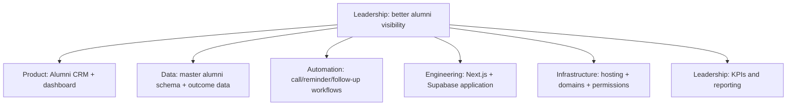

# Cross-Functional Technical Leadership

## Summary

I have an unusual ability to work across technical and non-technical teams — leadership, operations, product, engineering, data, DevOps, and program teams — and translate between them without losing meaning in either direction.

## What this looks like in practice

Leadership says: *"We need better visibility on alumni."* I can turn that into a distinct ask for each function:

## Why this is leadership, not just tool knowledge

Being able to originate all six of those asks — correctly scoped for the team that will actually execute each one — is a technology leadership capability. It's what lets one request from a non-technical stakeholder become a coordinated, coherent build across product, data, automation, engineering, and infrastructure, instead of getting lost in translation at each handoff.

## My Take

This is the practical, organizational expression of [[Business-to-Technology Translation & Digital Transformation]] — that note is about the translation itself; this one is about doing it *across a team*, where the translation has to hold up when four different specialists each pick up their piece.

## Related

- [[Business-to-Technology Translation & Digital Transformation]]
- [[Skill Positioning & Summary]]
- [[Technical Skills & Technology Stack]]
