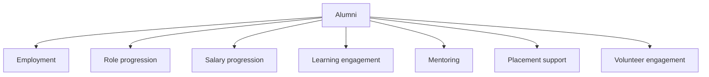

# Data Analytics & BI

## Summary

This is a **Strong** existing capability — substantial practical experience turning operational data into management information, not just building charts.

## Skills

KPI design, operational dashboards, data cleaning, data structuring, metrics frameworks, cohort thinking, funnel analysis, performance tracking, management dashboards, program analytics, alumni analytics, outcome tracking, data-driven decision-making.

## Tools

Google Sheets, Excel, SQL, Supabase, Notion, Python, dashboarding tools, spreadsheet automation.

## Example: alumni outcome metrics

I've also designed metrics frameworks around program performance and operational workload — the metric always exists to answer a specific management question, not to fill a dashboard slot.

## My analytics approach

I tend to ask **"what decision will this metric enable?"** rather than **"what data can we display?"** — that distinction is what separates a dashboard people actually act on from one that just gets glanced at.

## My Take

This is one of the notes in this profile I'm most confident in — `evergreen`, not `growing`. The KPI/dashboard/metrics-framework work here is the direct predecessor to the SQL/Python direction in [[SQL]] and [[Python]]: I already think analytically, I'm just extending the toolset I analyze with.

## Related

- [[Excel & Advanced Spreadsheets]]
- [[SQL]]
- [[Technical Skills & Technology Stack]]
