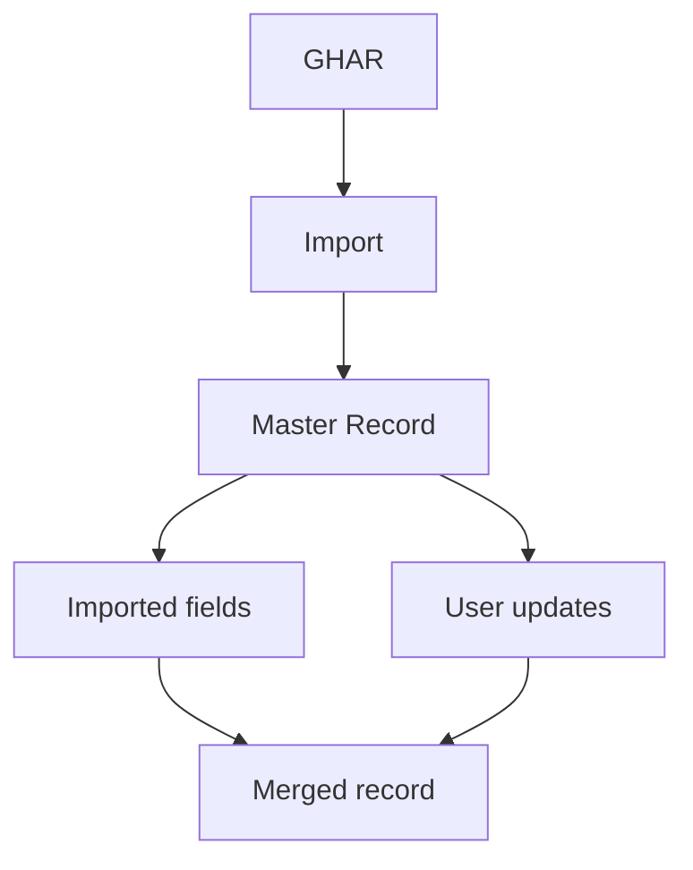

# Databases & Data Architecture

## Summary

My database thinking is closely connected to operational architecture, not abstract schema design. **Strong conceptual / Intermediate hands-on** — primary technology is Supabase / PostgreSQL.

## Core concepts

Relational databases, tables, primary keys, foreign-key relationships, constraints, timestamps, master records, data ownership, data lineage, data imports, data integrity, auditability, schema design.

## Supabase / PostgreSQL work

I've worked with Supabase projects, PostgreSQL, schema creation, database dumps, `pg_dump`, the Supabase CLI, project linking, schema replication, and migrations — including the practical failure modes (Docker connectivity issues, replication mismatches) that don't show up until you actually run a migration.

## Example: alumni master data architecture

I've worked with the concept of an `alumni_master` record containing identity, contact information, campus, program, entry year, technology stack, placement, company, position, salary, LinkedIn, status, dropout information, import batch, and timestamps — plus the operational data hanging off it: career progression, engagement, Pay Forward participation, call logs, and learning data.

## The architectural insight that matters most

I've explicitly thought through the distinction between **imported data** and **user-maintained data**:

The principle: **new imports should not blindly overwrite trusted user-generated information.** That's genuine data architecture thinking, not just table design — it's the difference between a database that stays trustworthy over time and one that silently degrades every time a sync job runs.

## My Take

This is the note I'd point to if someone doubted whether I actually understand data architecture versus just using Supabase as a hosted database. The imported-vs-user-maintained distinction is the kind of thing you only think carefully about after a sync job has already clobbered someone's manually-corrected record once.

## Related

- [[SQL]]
- [[Product & Systems Design]]
- [[Technical Skills & Technology Stack]]
