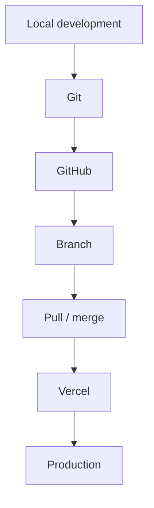

# Git, GitHub & Vercel

## Summary

**Working → Intermediate.** I understand the full chain from local development to production deployment, even where I'm not writing the deepest application code myself.

## Git

Repositories, commits, branches, pushes, and how they relate to deployment.

## GitHub

Repositories, source control, branches, pull requests, collaborative development.

## Vercel

Git-connected deployment, automatic deployment, production vs. development deployment concepts, branch-based workflows.

## My mental model

I've worked through **GitHub → Vercel → automatic deployment** directly, and explored how to commit without immediately deploying, create branches, push changes, deploy selectively, and manage development workflows deliberately rather than by accident.

## My Take

This is where my [[Web Application & Full-Stack Exposure]] becomes operational — knowing the deployment chain end-to-end means I can reason about *when* a commit should ship versus stay on a branch, which matters as much as writing the code itself once an application is live.

## Related

- [[Web Application & Full-Stack Exposure]]
- [[AWS & Amazon SES]]
- [[Technical Skills & Technology Stack]]
