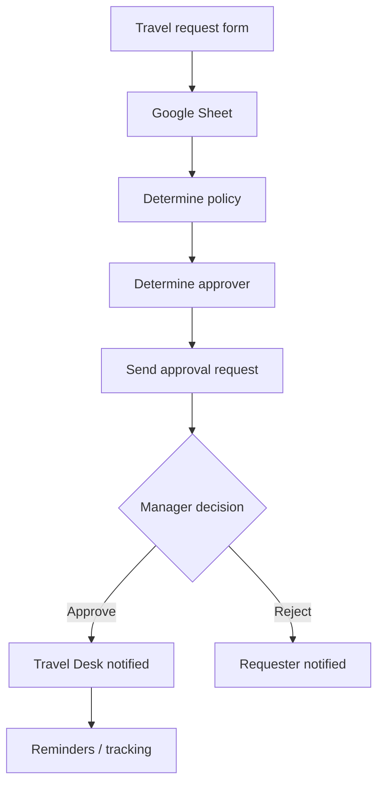

# Google Apps Script

## Summary

Google Apps Script is one of my most practically useful technologies — I've used it to turn Google Workspace from a collection of documents into lightweight applications. **Strong practical capability**, used extensively for operational automation and internal systems.

## Skills

Form submission triggers, spreadsheet automation, email automation, approval workflows, scheduled triggers, automated reminders, web-app handlers, logging, sheet manipulation, cross-sheet synchronization, status-based workflows, automated notifications, Google Workspace integration.

## Example: NG Travel Desk

This automation also involved priority calculations, travel-policy rules, approval/rejection handlers, mail logging, and scheduled reminders — a full business-process automation, not just a script that sends an email.

## My Take

This is the demonstration case for my whole [[Automation & Workflow Engineering]] approach: take a manual, paper-adjacent process (travel requests) and turn it into a form-triggered, policy-aware, self-reminding system, entirely inside tools most people think of as "just spreadsheets and forms." That's the real value of Apps Script for me — not the scripting language itself, but what it lets me do with Google Workspace as an application platform.

## Related

- [[Automation & Workflow Engineering]]
- [[Excel & Advanced Spreadsheets]]
- [[Technical Skills & Technology Stack]]
