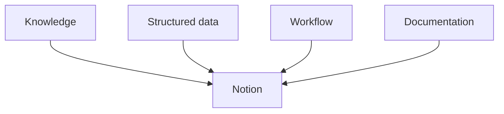

# Notion

## Summary

Notion is part of my broader knowledge + operational systems stack, used as an operational/productivity layer rather than simply as a notes application. **Strong practical.**

## Uses

Databases, trackers, operational systems, structured documentation, workflow management, curriculum databases, process tracking.

## My Take

The more interesting part isn't that I use Notion — it's *how*: as a hybrid of database, tracker, and documentation layer at once, the same instinct that shows up in [[Excel & Advanced Spreadsheets]] (using a tool past its "default" purpose) and in how I think about [[Automation & Workflow Engineering]] (workflow management, not just note-taking).

## Related

- [[Automation & Workflow Engineering]]
- [[Data Analytics & BI]]
- [[Technical Skills & Technology Stack]]
