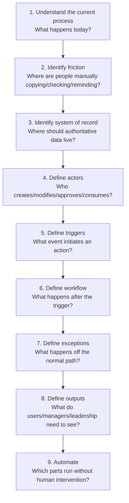
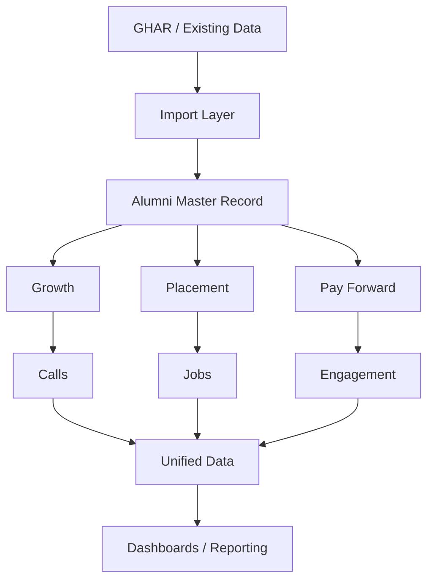

# Product & Systems Design

## Summary

My product and systems capability is about taking an ambiguous business or operational problem and converting it into a structured technology solution. I don't approach a problem as "we need an app" — I break it down as **problem → users → process → data → roles → triggers → actions → exceptions → outputs → reporting → automation**. This is one of my strongest technical capabilities, at an **Advanced** level.

## Core skills

- Requirements gathering, PRD development, functional requirements
- Workflow design, user journey mapping, process mapping
- System architecture, data architecture
- Role and permission design
- Source-of-truth definition, data ownership, auditability
- Exception handling, escalation design
- Automation opportunity identification
- Reporting requirements, product feature definition

## My typical approach

## Example: NGConnect

I've approached NGConnect not merely as a database but as an operating system for alumni/placement/growth functions, considering: CRM architecture, alumni master records, imported vs. user-generated data, data ownership, role-based access, placement workflows, alumni engagement, job boards, impact dashboards, data synchronization, auditability, and automation triggers.

I regularly translate operational requirements into technical workflows rather than simply documenting them — that's the difference between a requirements doc and an actual system design.

## My Take

This is the capability everything else in my stack sits on top of. n8n, Supabase, SQL — those are how I *implement* a design; this note is about how I *arrive at* the design in the first place. The nine-step approach above isn't a framework I read somewhere — it's genuinely how NGConnect, the Travel Desk, and every automation I've built actually got designed, in that order, every time.

## Related

- [[Technical Skills & Technology Stack]] — the MOC this note belongs to
- [[Automation & Workflow Engineering]] — where these designs get implemented
- [[Databases & Data Architecture]] — the data-layer half of every system I design
