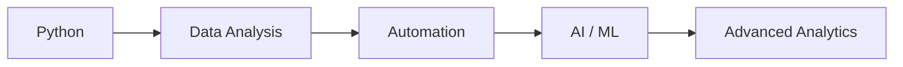

# Python

## Summary

Python is currently a development area for me. I'm not primarily learning it as a software-engineering specialization — I'm learning it as the technical foundation for a broader capability.

## Current focus

Programming fundamentals, problem solving, functions, data structures, algorithms, data manipulation, automation, analytics.

## Where I'm heading

Pandas, NumPy, visualization, APIs, data pipelines, machine learning, AI applications — specifically working toward a combined **SQL + Python + AI/ML** capability rather than treating Python as an isolated programming language to learn for its own sake.

## My Take

Same honesty as [[SQL]]: this is `seedling`, and that's accurate, not modest. The value of Python for me isn't "I can write scripts" — it's that it's the connective tissue between the analytics I already do well (Excel, dashboards, KPIs) and the AI/ML direction I'm building toward. Worth tracking as a pair with SQL since they're being learned together, deliberately.

## Related

- [[SQL]]
- [[AI and ML Learning]]
- [[Technical Skills & Technology Stack]]
