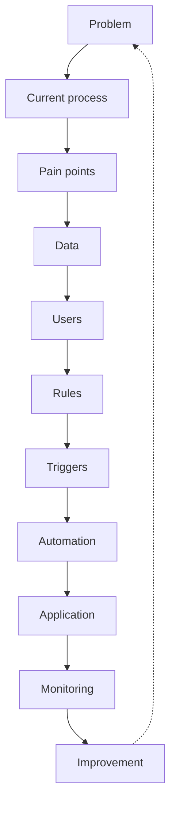

# Systems Thinking & Technical Problem-Solving

## Summary

This deserves its own note because it cuts across everything else in this profile — arguably my **strongest technical differentiator**, at an **Advanced** level.

## My strongest pattern

I naturally identify: fragmented systems, duplicate data, manual processes, repeated work, missing ownership, missing triggers, reporting gaps, unnecessary human intervention, weak source-of-truth structures. Then I redesign the system.

My underlying model for how information should flow through any system: **input → validation → database → trigger → workflow → decision → communication → response → logging → dashboard → escalation.** That's the same loop as the diagram above, phrased as data flow instead of process stages — the loop closes (monitoring feeds back into the next round of improvement), which is why it's a system, not a one-off fix.

## Technical problem-solving in practice

I've demonstrated practical troubleshooting across layers: Supabase CLI issues, PostgreSQL/`pg_dump` problems, Docker connectivity, Git/Vercel deployment behavior, spreadsheet file-size constraints, Excel format limitations, database schema replication, automation architecture, deployment architecture, email infrastructure, DNS/SMTP requirements. That's cross-stack debugging literacy, even in places where I'm not the one who wrote the underlying infrastructure code.

## My Take

This is arguably more valuable to my career than any individual technology in this whole stack. Every other note in this profile — [[n8n]], [[Databases & Data Architecture]], [[Excel & Advanced Spreadsheets]] — is a place where this pattern got *applied*; this note is the pattern itself, and it's the reason I can move into a tool I don't know yet and still be useful quickly.

## Related

- [[Product & Systems Design]]
- [[Business-to-Technology Translation & Digital Transformation]]
- [[Technical Skills & Technology Stack]]
