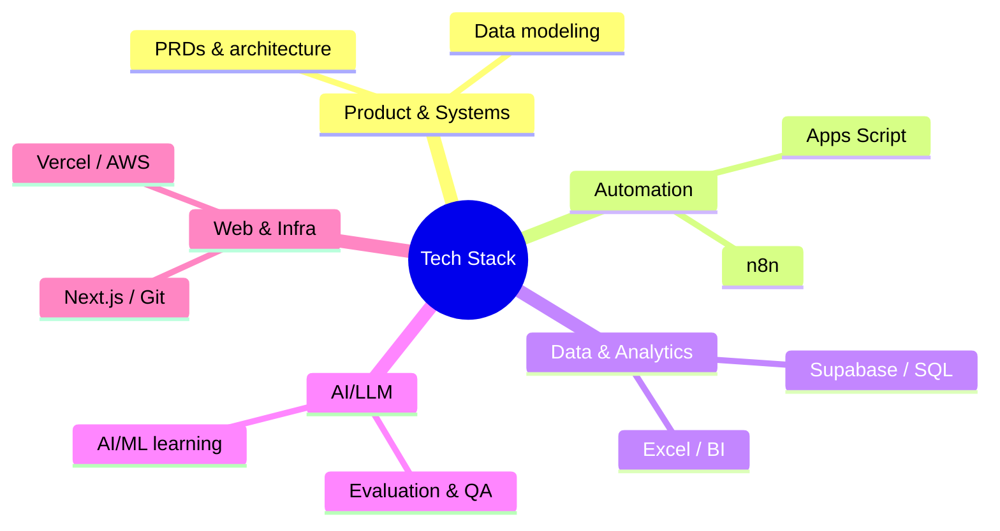

# Technical Skills & Technology Stack

## Summary

A consolidated profile of technical skill areas and proficiency levels: product/systems design, automation engineering (n8n, Apps Script), data architecture (Supabase/PostgreSQL, SQL), analytics/BI, AI/LLM evaluation, and web/cloud tooling (Next.js, Git, Vercel, AWS) — plus a recommended way to position all of it professionally.

## Skill domains at a glance

## 1. Technical Profile

**Technology & Automation | Product Systems | Data & Analytics | AI/LLM Operations**

Hands-on technology and operations professional with experience designing and implementing internal platforms, workflow automations, data systems, dashboards, and AI evaluation processes. Strong ability to translate business and operational requirements into technical specifications, database structures, workflows, automations, and product features.

Experienced in working across the full problem-solving cycle: **requirements → process design → data architecture → automation → product implementation → testing → deployment → monitoring**.

Particularly strong at working with no/low-code and developer-oriented tools to independently prototype, build, troubleshoot, and operationalize systems while collaborating with engineering and DevOps teams where deeper infrastructure or application engineering is required.

---

## 2. Core Technology Stack

### A. Product & Systems Design

**Strong / Advanced**

* Product requirements definition
* PRD development
* Workflow and process architecture
* Functional requirements
* User-role and permission design
* Data-model design
* System architecture thinking
* Process digitization
* Internal tools / operations platforms
* CRM architecture
* Product feature definition
* Automation architecture
* User journeys and workflow mapping
* Exception handling and escalation design
* Auditability and data lineage
* Source-of-truth architecture
* Cross-functional technical requirements

#### Examples

Worked extensively on systems such as **NGConnect**, an internal alumni/placement/growth platform, considering:

* CRM architecture
* Alumni master records
* Imported vs user-generated data
* Data ownership
* Role-based access
* Placement workflows
* Alumni engagement
* Job boards
* Impact dashboards
* Data synchronization
* Auditability
* Automation triggers

Regularly translates operational requirements into technical workflows rather than simply documenting them.

---

## 3. Automation & Workflow Engineering

**Strong / Advanced**

### Technologies

* **n8n**
* **Google Apps Script**
* Google Forms
* Google Sheets
* Google Workspace
* Notion
* Email automation
* Webhooks / event-driven workflows
* Scheduled workflows
* API-based integrations

### Capabilities

* Event-driven automation
* Scheduled automation
* Form → database workflows
* Form → Sheets workflows
* Approval workflows
* Reminder systems
* Email notifications
* Escalation workflows
* Status-based triggers
* Automated follow-ups
* Data synchronization
* Workflow logging
* Error/exception handling
* Automated reporting
* Multi-step business processes

### Practical implementations

Designed/worked on workflows involving:

**Google Form → Google Sheet → approval → email → reminder → status update → tracker**

and more complex systems involving:

**Database → workflow engine → communication → response capture → CRM update → dashboard/reporting**

Also thought through centralized automation infrastructure, including:

* AWS-hosted n8n
* persistent workflow execution
* production vs development workflows
* expected workflow volumes
* subdomains
* SMTP
* Amazon SES
* IAM permissions
* DNS configuration
* Supabase integration
* WhatsApp/SMS integration considerations

---

## 4. n8n

**Intermediate → Advanced practical capability**

Demonstrated practical understanding of n8n beyond simply creating basic workflows.

### Areas

* Workflow architecture
* Trigger design
* Event-driven automation
* Scheduled triggers
* API integrations
* Google Workspace integrations
* Database integrations
* Email workflows
* Reminder engines
* Conditional logic
* Workflow sequencing
* Production deployment considerations
* Workflow scalability
* Hosting architecture
* Environment separation
* Monitoring considerations

Also considered the infrastructure implications of scaling from a few workflows to approximately **25–30 production/development workflows**.

---

## 5. Google Apps Script

**Strong practical capability**

Used extensively for operational automation and internal systems.

### Skills

* Form submission triggers
* Spreadsheet automation
* Email automation
* Approval workflows
* Scheduled triggers
* Automated reminders
* Web-app handlers
* Logging
* Sheet manipulation
* Cross-sheet synchronization
* Status-based workflows
* Automated notifications
* Integration with Google Workspace

### Example

The NG Travel Desk automation involved concepts such as:

* Travel request form
* Google Sheets backend
* approval routing
* manager notifications
* Travel Desk notifications
* automated reminders
* approval/rejection handling
* mail logging
* priority calculation
* travel-policy rules

This demonstrates practical business-process automation rather than only scripting knowledge.

---

## 6. Databases & Data Architecture

**Strong conceptual / Intermediate hands-on implementation**

### Primary technology

**Supabase / PostgreSQL**

Worked with:

* Relational database design
* PostgreSQL
* Supabase
* Tables
* Primary keys
* Constraints
* Data imports
* Schema migration
* Data synchronization
* Data integrity
* Source-of-truth architecture
* Auditability
* Structured master records

### Example

Designed/worked with an `alumni_master` schema containing structured information such as:

* email
* phone
* name
* gender
* location
* campus
* course
* entry year
* technology stack
* donor
* employment
* company
* position
* salary
* placement date
* LinkedIn
* status
* dropout information
* timestamps
* import batch information

Also worked through practical Supabase database migration issues, including:

* database dumps
* schema replication
* PostgreSQL tooling
* `pg_dump`
* Supabase CLI
* project linking
* Docker-related issues

---

## 7. SQL

**Developing → Intermediate**

An active skill area, with a deliberate learning/practice plan.

### Current capability areas

* SELECT
* filtering
* sorting
* aggregation
* GROUP BY
* joins
* subqueries
* data analysis
* relational thinking
* database querying

Building toward stronger proficiency in:

* complex joins
* CTEs
* window functions
* analytical SQL
* query optimization
* database design
* production data analysis

This SQL learning is closely connected to work with **Supabase, alumni data, dashboards, analytics, and operational systems**.

---

## 8. Python

**Developing → Intermediate**

An active learning and technical-development area.

The current learning approach includes regular problem-solving practice and building toward:

* programming fundamentals
* data manipulation
* automation
* analytics
* AI/ML
* algorithmic problem solving

Specifically working toward using Python as part of a broader **SQL + Python + AI/ML** capability rather than treating it purely as a programming language.

---

## 9. Data Analytics & BI

**Strong**

Substantial practical experience with data-driven operational analysis.

### Skills

* KPI design
* Operational dashboards
* Data cleaning
* Data structuring
* Metrics frameworks
* Cohort thinking
* Funnel analysis
* Performance tracking
* Management dashboards
* Program analytics
* Alumni analytics
* Outcome tracking
* Data-driven decision-making

### Tools

* Google Sheets
* Excel
* SQL
* Supabase
* Notion
* Python
* Dashboarding tools
* Spreadsheet automation

Designed analytical frameworks around:

* alumni outcomes
* employment
* role progression
* salary progression
* mentoring
* placement support
* learning engagement
* volunteer engagement
* program performance
* operational workload

---

## 10. Excel / Advanced Spreadsheets

**Strong**

Spreadsheet capability significantly beyond basic Excel usage.

### Skills

* Complex formulas
* Data transformation
* KPI calculations
* Dashboard construction
* Data validation
* Structured trackers
* Operational databases in Sheets
* Formula-driven analysis
* Scenario analysis
* Automated reporting
* Multi-sheet architecture
* Data imports/exports
* Spreadsheet optimization
* File-size optimization

Also understands the limitations of spreadsheets as databases, and has repeatedly worked on transitioning processes from **Sheets → structured database → application/automation layer**.

---

## 11. Web Application / Full-Stack Product Exposure

**Intermediate / Product-builder level**

### Technologies encountered and worked with

* **Next.js**
* **React ecosystem**
* **Supabase**
* **Tailwind CSS**
* JavaScript / TypeScript ecosystem
* APIs
* Git/GitHub
* Vercel

The strongest capability here is not low-level frontend engineering; it is **understanding and driving application architecture from the product/system side**.

For example, NGConnect has involved thinking through:

**Frontend → application logic → Supabase → automation → data/reporting**

This enables communicating effectively with developers and reasoning about how an operational requirement translates into application functionality.

---

## 12. Git & GitHub

**Intermediate practical**

### Skills

* Git repositories
* Branching
* Commits
* Pull requests
* Deployment workflows
* Repository management
* Git-based deployment
* Vercel integration
* Development vs production considerations

Worked through workflows such as:

**GitHub → Vercel → automatic deployment**

and explored how to:

* commit without immediately deploying
* create branches
* push changes
* deploy selectively
* manage development workflows

---

## 13. Vercel

**Practical / Intermediate**

Experience with:

* Git-connected deployments
* automatic deployment
* branch-based development
* production vs development deployment concepts
* deploying web applications
* understanding the relationship between Git commits and deployments

---

## 14. AWS / Cloud Infrastructure

**Foundational → Intermediate**

Practical exposure to cloud architecture, particularly around deploying automation infrastructure.

### Areas

* AWS EC2
* persistent server deployment
* hosting n8n
* DNS/subdomains
* IAM
* SMTP
* Amazon SES
* infrastructure requirements
* deployment constraints
* storage considerations
* cost estimation

Also involved in discussions with DevOps around defining infrastructure requirements rather than simply consuming infrastructure as a black box.

---

## 15. Amazon SES / Transactional Email

**Practical**

Worked through:

* transactional email architecture
* SMTP
* Amazon SES
* DNS configuration
* sending-volume estimation
* cost estimation
* domain/subdomain requirements
* automated email delivery

Estimated email requirements at approximately **45,000 emails/month** for operational workflows, and considered the economics of SES against alternative providers.

---

## 16. AI / LLM Technology

**Strong / Advanced operational capability**

This is one of the strongest technical areas.

### Experience

* LLM evaluation
* AI response evaluation
* Generative AI
* AI quality assurance
* AI model evaluation
* reviewer operations
* evaluation frameworks
* multimodal evaluation
* reasoning evaluation
* factuality assessment
* instruction adherence
* dataset evaluation
* AI quality processes
* reviewer SOPs
* AI evaluation operations

Worked as an:

**AI Quality Assurance / Pod Lead – LLM Evaluation**

and

**AI Evaluator – LLM Response Evaluation**

with experience around enterprise-scale LLM evaluation programs.

Also designed:

* reviewer SOPs
* evaluation frameworks
* onboarding systems
* quality-control mechanisms
* reviewer workflows
* multimodal evaluation processes

---

## 17. AI/ML Learning

**Developing**

Actively building deeper capability in:

* machine learning
* AI fundamentals
* Python for ML
* data analysis
* model concepts
* generative AI
* LLMs
* AI evaluation

The current direction is particularly valuable because it combines:

**AI + Analytics + SQL + Python + Operations + Product**

rather than treating AI as an isolated technical specialization.

---

## 18. APIs & Integrations

**Intermediate practical**

Worked conceptually and practically with integrations across:

* Google Workspace
* Supabase
* n8n
* web applications
* email systems
* Vercel
* GitHub
* internal applications
* potential WhatsApp Business API
* SMS providers

The core strength is understanding **how systems should communicate and where automation should sit between them**.

---

## 19. Notion

**Strong practical**

Uses include:

* databases
* trackers
* operational systems
* structured documentation
* workflow management
* curriculum databases
* process tracking

Tends to use Notion as an operational/productivity layer rather than simply as a notes application.

---

## 20. Systems Thinking

**Advanced**

Arguably the strongest technical differentiator.

Naturally thinks in terms of:

**Input → validation → database → trigger → workflow → decision → communication → response → logging → dashboard → escalation**

Frequently identifies:

* duplicated data
* missing ownership
* manual handoffs
* fragmented systems
* inconsistent sources
* unnecessary human intervention
* missing audit trails
* automation opportunities
* reporting gaps

This allows operating effectively at the intersection of **technology, operations, strategy, and product**.

---

## 21. Technical Problem-Solving

Demonstrated practical ability to troubleshoot issues across different layers of a technology stack.

Examples include:

* Supabase CLI issues
* PostgreSQL / `pg_dump`
* Docker connectivity
* Git/Vercel deployment behaviour
* spreadsheet file-size constraints
* Excel format limitations
* database schema replication
* automation architecture
* deployment architecture
* email infrastructure
* DNS/SMTP requirements

This indicates strong **technical debugging literacy**, even where not personally writing the underlying infrastructure code.

---

## 22. Recommended Skill Positioning

Not positioned as:

> Software Engineer / Full-Stack Developer

The stronger and more accurate positioning:

> **Technology, Automation & Data Systems Leader**

or:

> **Product & Automation Strategist | Data & AI Systems | Digital Transformation**

or, for a more technical resume:

> **Technology & Automation | Product Systems | Data Analytics | AI/LLM Operations**

The differentiator is the ability to **bridge business/operations and technology**: understanding the problem at the CEO/operations level, designing the process, translating it into a technical architecture, building or prototyping substantial portions independently using automation and development tools, and working with engineers/DevOps to productionize it.

---

## 23. Consolidated Technology Matrix

| Area                      | Technologies / Skills                       | Level                       |
| ------------------------- | ------------------------------------------- | --------------------------- |
| Product & Systems Design  | PRDs, workflows, architecture, requirements | **Advanced**                |
| Automation                | n8n, Apps Script, Google Workspace          | **Advanced**                |
| Operational Automation    | Approval, reminders, notifications, logging | **Advanced**                |
| Data Architecture         | Relational DB, master data, data lineage    | **Strong**                  |
| Supabase                  | PostgreSQL-backed applications              | **Strong / Intermediate**   |
| SQL                       | Analytics, joins, aggregation, querying     | **Developing–Intermediate** |
| Python                    | Programming, analytics, AI/ML foundation    | **Developing–Intermediate** |
| Excel                     | Analytics, formulas, dashboards, modelling  | **Strong**                  |
| Google Sheets             | Advanced operational systems                | **Advanced**                |
| Analytics                 | KPIs, dashboards, program analytics         | **Strong**                  |
| AI/LLM                    | Evaluation, QA, multimodal, reasoning       | **Advanced**                |
| AI/ML                     | ML concepts and implementation              | **Developing**              |
| Next.js                   | Application/product exposure                | **Intermediate**            |
| Supabase                  | Backend/database/application layer          | **Intermediate–Strong**     |
| Tailwind                  | Frontend exposure                           | **Working knowledge**       |
| Git/GitHub                | Branching, commits, deployment workflows    | **Intermediate**            |
| Vercel                    | Application deployment                      | **Working knowledge**       |
| AWS EC2                   | Hosting/infrastructure architecture         | **Working knowledge**       |
| Amazon SES                | Transactional email infrastructure          | **Working knowledge**       |
| APIs                      | Integration architecture                    | **Intermediate practical**  |
| Notion                    | Databases/workflows/documentation           | **Strong**                  |
| Technical Troubleshooting | Cross-stack debugging                       | **Strong**                  |
| System Integration        | Connecting tools/platforms/workflows        | **Strong**                  |
| Technical Strategy        | Technology → business outcomes              | **Advanced**                |

## 24. One-Line Technical Summary

**Technology, automation and data systems leader with hands-on experience across n8n, Google Apps Script, Supabase/PostgreSQL, SQL, Python, Next.js, Git/GitHub, Vercel, AWS, Google Workspace, and AI/LLM evaluation—specializing in converting complex operational processes into scalable digital systems and automated workflows.**

## My Take

The throughline isn't any single tool — it's the habit of translating an operational problem straight into a system: n8n/Apps Script for the automation layer, Supabase/SQL for the data layer, dashboards for the feedback loop, and AI/LLM evaluation as the newest strong suit. The honest gap is depth in code (SQL/Python/AI-ML are explicitly "Developing," not "Strong") — that's the trajectory worth tracking over time in this note, not treating the matrix above as a fixed snapshot. The AI/LLM evaluation experience is also the most direct bridge to the Mnemos work in [[App Scope]]: evaluating LLM output quality and building an LLM-grounded assistant draw on the same "does this response actually hold up" judgment.

## Related

- [[App Scope]] — the Mnemos project this AI/LLM and systems-thinking background feeds into directly
- [[Second Brain - PKM Tools Survey (Aug 2026)]] — the AI/LLM tooling landscape research this profile's AI/LLM operations experience connects to
- [[NGConnect]] — the internal platform referenced throughout as the primary example of product/systems design and CRM architecture work (note not yet written)
