# Technical Skills & Technology Stack

## Summary

I'm a hands-on technology and operations professional with experience designing and implementing internal platforms, workflow automations, data systems, dashboards, and AI evaluation processes. My strongest ability is translating business and operational requirements into technical specifications, database structures, workflows, automations, and product features — working across the full cycle: **requirements → process design → data architecture → automation → product implementation → testing → deployment → monitoring**.

I'm particularly effective with no/low-code and developer-oriented tools, independently prototyping, building, troubleshooting, and operationalizing systems while collaborating with engineering and DevOps teams where deeper infrastructure or application engineering is required.

**One-line summary**: Technology, automation and data systems leader with hands-on experience across n8n, Google Apps Script, Supabase/PostgreSQL, SQL, Python, Next.js, Git/GitHub, Vercel, AWS, Google Workspace, and AI/LLM evaluation — specializing in converting complex operational processes into scalable digital systems and automated workflows.

## Structure

This MOC deliberately stays at cluster level — the exhaustive taxonomy (every leaf skill under every branch) lives in each child note's own diagram, per [[07 - Mermaid Diagram Standards]]'s rule that an overgrown diagram gets split into a parent-in-the-MOC plus child diagrams, not crammed into one.

```mermaid
flowchart TD
    M["Technical Skills & Technology Stack (MOC)"]
    M --> P[Product & Systems Design]
    M --> A[Automation & Workflow Engineering]
    M --> D[Data & Analytics]
    M --> W[Web Application & Infrastructure]
    M --> AI["AI / LLM & Machine Learning"]
    M --> S["Approach, Problem-Solving & Positioning"]
    M --> X[Cross-Cutting Technical Capabilities]

    A --> A1[n8n]
    A --> A2[Google Apps Script]
    A --> A3[APIs & Integrations]

    D --> D1[Databases & Data Architecture]
    D --> D2[SQL]
    D --> D3[Python]
    D --> D4[Data Analytics & BI]
    D --> D5[Excel & Advanced Spreadsheets]

    W --> W1[Web Application & Full-Stack Exposure]
    W --> W2["Git, GitHub & Vercel"]
    W --> W3[AWS & Amazon SES]
    W --> W4[Notion]

    AI --> AI1["AI and LLM Technology"]
    AI --> AI2["AI and ML Learning"]

    S --> S1[Systems Thinking & Technical Problem-Solving]
    S --> S2[Business-to-Technology Translation & Digital Transformation]
    S --> S3[Cross-Functional Technical Leadership]
    S --> S4[Skill Positioning & Summary]
```

## Linked notes, by cluster

### Product & Systems Design
- [[Product & Systems Design]]

### Automation & Workflow Engineering
- [[Automation & Workflow Engineering]]
- [[n8n]]
- [[Google Apps Script]]
- [[APIs & Integrations]]

### Data & Analytics
- [[Databases & Data Architecture]]
- [[SQL]]
- [[Python]]
- [[Data Analytics & BI]]
- [[Excel & Advanced Spreadsheets]]

### Web Application & Infrastructure
- [[Web Application & Full-Stack Exposure]]
- [[Git, GitHub & Vercel]]
- [[AWS & Amazon SES]]
- [[Notion]]

### AI / LLM & Machine Learning
- [[AI and LLM Technology]]
- [[AI and ML Learning]]

### Approach, Problem-Solving & Positioning
- [[Systems Thinking & Technical Problem-Solving]]
- [[Business-to-Technology Translation & Digital Transformation]]
- [[Cross-Functional Technical Leadership]]
- [[Skill Positioning & Summary]]

### Cross-Cutting Technical Capabilities
- [[Cross-Cutting Technical Capabilities]]

## Consolidated Technology Matrix

| Area | Technologies / Skills | Level |
|---|---|---|
| Product & Systems Design | PRDs, workflows, architecture, requirements | **Advanced** |
| Automation | n8n, Apps Script, Google Workspace | **Advanced** |
| Operational Automation | Approval, reminders, notifications, logging | **Advanced** |
| Data Architecture | Relational DB, master data, data lineage | **Strong** |
| Supabase | PostgreSQL-backed applications | **Strong / Intermediate** |
| SQL | Analytics, joins, aggregation, querying | **Developing–Intermediate** |
| Python | Programming, analytics, AI/ML foundation | **Developing–Intermediate** |
| Excel | Analytics, formulas, dashboards, modelling | **Strong** |
| Google Sheets | Advanced operational systems | **Advanced** |
| Analytics | KPIs, dashboards, program analytics | **Strong** |
| AI/LLM | Evaluation, QA, multimodal, reasoning | **Advanced** |
| AI/ML | ML concepts and implementation | **Developing** |
| Next.js | Application/product exposure | **Intermediate** |
| Supabase | Backend/database/application layer | **Intermediate–Strong** |
| Tailwind | Frontend exposure | **Working knowledge** |
| Git/GitHub | Branching, commits, deployment workflows | **Intermediate** |
| Vercel | Application deployment | **Working knowledge** |
| AWS EC2 | Hosting/infrastructure architecture | **Working knowledge** |
| Amazon SES | Transactional email infrastructure | **Working knowledge** |
| APIs | Integration architecture | **Intermediate practical** |
| Notion | Databases/workflows/documentation | **Strong** |
| Technical Troubleshooting | Cross-stack debugging | **Strong** |
| System Integration | Connecting tools/platforms/workflows | **Strong** |
| Technical Strategy | Technology → business outcomes | **Advanced** |

## Recommended positioning

I wouldn't position myself as *Software Engineer / Full-Stack Developer*. The more accurate framing is:

> **Technology, Automation & Data Systems Leader**

or, for a more technical resume:

> **Technology & Automation | Product Systems | Data Analytics | AI/LLM Operations**

Full reasoning in [[Skill Positioning & Summary]].

## My Take

If I compress the whole stack into one idea: my tool stack (n8n, Supabase, SQL, Python, Next.js, AWS...) is the *implementation layer*. My actual technical competency is **systems design + automation + data + AI + product thinking** — the ability to sit with a business problem, design the process, translate it into architecture, build a meaningful chunk of it myself, and hand off the rest to engineering/DevOps cleanly. The honest gap, tracked per-note via `status`, is depth in code (SQL, Python, AI/ML are `seedling`/`growing`, not `evergreen`) — that's the trajectory worth revisiting this MOC to check on, not a fixed snapshot.
