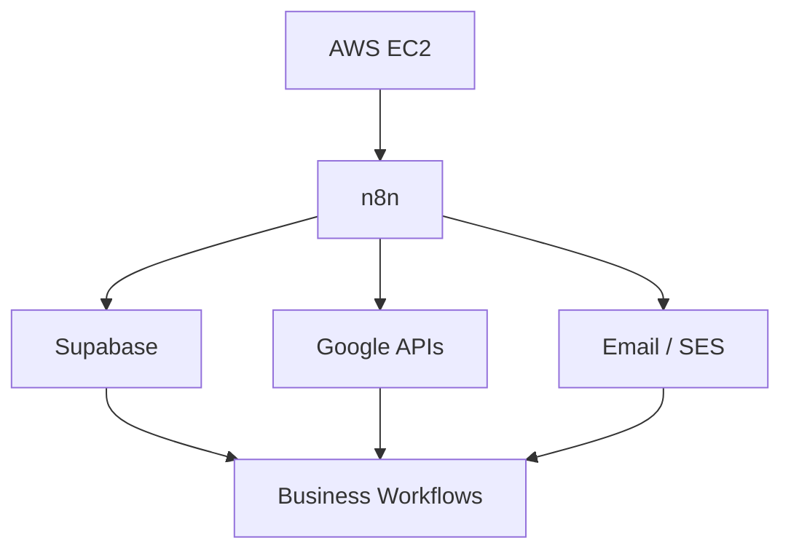

# n8n

## Summary

n8n is the automation/orchestration layer I've been using to connect applications, databases, communication systems, and business processes. My capability is **Intermediate → Advanced practical** — I understand it primarily as an operational workflow engine, not just a tool for wiring two APIs together.

## What I work with

Workflow architecture, trigger design, event-driven automation, scheduled triggers, API integrations, Google Workspace integrations, database integrations, email workflows, reminder engines, conditional logic, workflow sequencing, production deployment considerations, workflow scalability, hosting architecture, environment separation, monitoring considerations.

## Architecture thinking

I've considered what happens when automation becomes infrastructure rather than a handful of scripts:

That includes persistent hosting, workflow count, production/development separation, infrastructure costs, subdomains, DNS, IAM, SES, storage, and scalability — see [[AWS & Amazon SES]] for the infrastructure side of this in full.

I've also considered the infrastructure implications of scaling from a few workflows to roughly **25–30 production/development workflows** — at that volume, environment separation and monitoring stop being optional.

## Demonstrated application

I've built n8n automation around Travel Desk, Alumni Growth, Pay Forward, and CEO Office workflows — reminders, approvals, call logging, and notifications.

## My Take

n8n is where my [[Automation & Workflow Engineering]] capability actually runs. The intermediate-to-advanced label reflects real production usage, not tutorial-level workflows — but the honest next step is the infrastructure side (persistent hosting, environment separation at scale) rather than more workflow logic, which I'm already comfortable with.

## Related

- [[Automation & Workflow Engineering]]
- [[AWS & Amazon SES]]
- [[Technical Skills & Technology Stack]]
