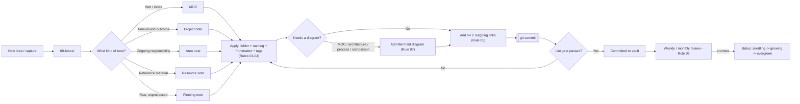

# Vault Rules — Index

This is the hub note for every rule governing this vault. It replaces the old single-file "Obsidian Vault Rules" note — each concern now has its own atomic note so it can be linked to directly, updated independently, and actually followed instead of skimmed.

> [!important] Read this before creating, editing, or committing any `.md` file
> Human or AI agent, same bar. If you're an assistant working in this repo, see [[10 - Agent and AI Assistant Protocol]] for the exact pre-flight sequence and how this gets enforced mechanically, not just by good intentions.

---

## The rule set

| # | Note | Answers |
|---|---|---|
| 01 | [[01 - Folder Structure]] | Where does this note live? |
| 02 | [[02 - File Naming]] | What is this note called? |
| 03 | [[03 - Frontmatter and Metadata]] | What YAML does every note need? |
| 04 | [[04 - Tagging]] | What tags, and how many? |
| 05 | [[05 - Linking and Graph Discipline]] | How does this note connect to the rest? |
| 06 | [[06 - Note Structure and Templates]] | What sections does the body need? |
| 07 | [[07 - Mermaid Diagram Standards]] | When and how do I diagram this? |
| 08 | [[08 - Review and Maintenance Cadence]] | How does the vault stay alive, not just grow? |
| 09 | [[09 - Plugin Stack]] | What tooling backs all of this? |
| 10 | [[10 - Agent and AI Assistant Protocol]] | How is this actually enforced for AI agents? |

---

## Why split it up

A single 100-line rules file is exactly the kind of note these rules exist to prevent: one undifferentiated blob instead of atomic, linkable ideas. Splitting by perspective means:

- Each rule note can be linked from the exact place it's relevant (a template can link `[[03 - Frontmatter and Metadata]]` directly instead of "see the rules doc, section 3").
- The graph shows the rule set as a real cluster radiating from this MOC, instead of one disconnected node.
- Any one rule can be revised without touching the others.

---

## The note lifecycle these rules cover

---

## Condensed pre-commit checklist

Full detail lives in each linked note — this is the cheat-sheet version:

- [ ] Filed under the right top-level folder, max 2 levels deep (Rule 01)
- [ ] Filename is descriptive and atomic, no `Untitled`/`notes3` (Rule 02)
- [ ] Frontmatter complete: `title, aliases, tags, type, status, created, updated, related, source` (Rule 03)
- [ ] 1–7 tags, drawn from `[[Tag Index]]`, not invented ad hoc (Rule 04)
- [ ] At least 2 outgoing `[[links]]` to existing notes (Rule 05)
- [ ] Body has the required sections for this note's `type` (Rule 06)
- [ ] A Mermaid diagram is present if this is a MOC, or documents architecture/process/comparison (Rule 07)
- [ ] `Clippings/` and `06-Templates/` are exempt from the frontmatter schema — see Rule 03

## Enforcement, in short

Reading this note is the soft layer — it relies on whoever (or whatever) is writing the note actually opening it. The hard layer doesn't:

- `scripts/lint_vault.py` mechanically checks the checklist above against every changed `.md` file.
- `.githooks/pre-commit` runs it locally before a commit is allowed (once `scripts/setup-hooks.sh` has been run).
- `.github/workflows/vault-lint.yml` runs it on every push/PR on GitHub, independent of any local setup.

Full detail, including how this applies specifically to AI coding agents working in this repo, is in [[10 - Agent and AI Assistant Protocol]].
