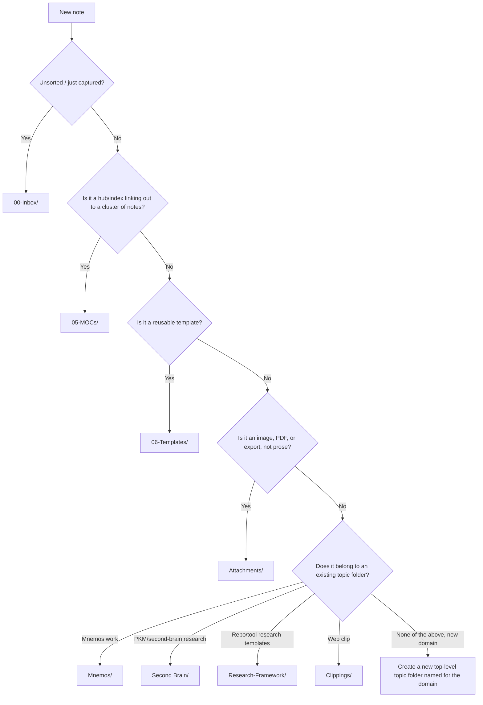

# Folder Structure

Graph view rewards **links over folder nesting** — folders separate by *function* (what stage of processing a note is in), not by *topic* (topic lives in tags and links, see [[04 - Tagging]]). This vault runs a **hybrid PARA**: fixed function folders for the parts every vault needs, plus topic folders for actual domains of work, which already existed here before this rule set did.

---

## 1. Fixed function folders (new, added by this rule set)

```
00-Inbox/          # unsorted capture — processed weekly, see Rule 08
05-MOCs/           # Maps of Content: hub notes + the Tag Index
06-Templates/      # note templates, see Rule 06 (exempt from the frontmatter schema)
Attachments/       # images, PDFs, exports — kept out of the note graph
```

## 2. Existing topic folders (grandfathered, keep using them)

```
Mnemos/              # the Mnemos project — active, time-bound outcome (a "Project" in PARA terms)
Second Brain/        # PKM/second-brain research — ongoing area of interest
Research-Framework/  # reusable research templates/frameworks — reference material
Clippings/           # web-clipper output — reference material, own schema (see Rule 03)
Rules/               # this rule set — vault meta
```

These predate this rule set and are not being renamed or restructured retroactively. New topic folders can be added the same way when a new domain of work starts (e.g. a future project gets its own top-level folder), following the decision tree below.

---

## 3. Where does a new note go?



## 4. Depth rule

**Max 2 folder levels deep**, including topic folders. If a topic folder needs a third level to stay organized, that's a signal the sub-grouping should be a tag (`#mnemos/backend`) or a MOC linking the relevant notes, not another folder layer.

## 5. Graph view hygiene

Exclude function folders that add noise without adding meaning to the graph:

```
-path:"06-Templates" -path:"Attachments" -path:".obsidian"
```

See [[05 - Linking and Graph Discipline]] for the rest of graph-view configuration.
