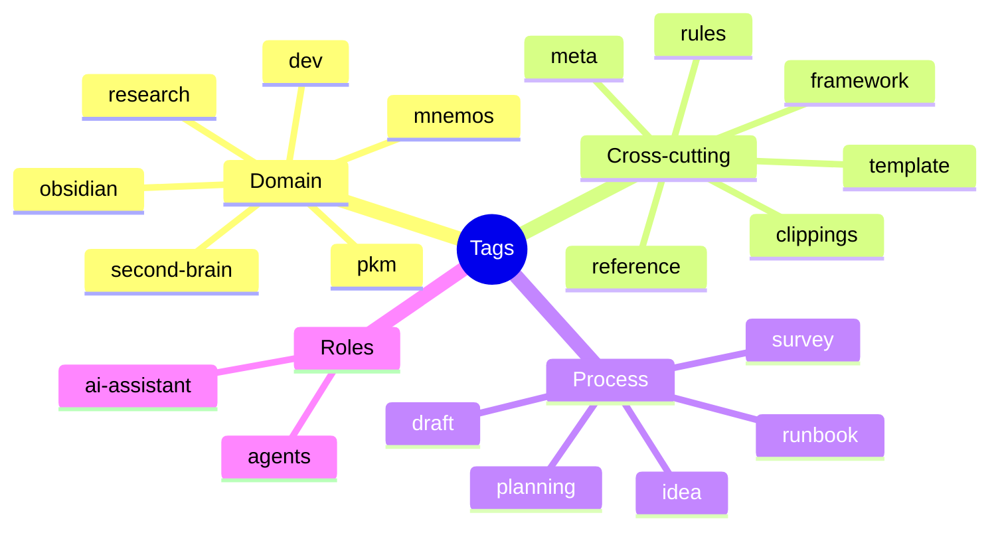

# Tagging

Tags answer **"what kind of thing / what domain is this"**. Folders answer **"where does this live in my workflow"** (see [[01 - Folder Structure]]). Links answer **"what specific idea does this connect to"** (see [[05 - Linking and Graph Discipline]]). Don't use one to do another's job — that's how tag lists balloon and stop being useful filters.

---

## 1. Hard limits

- **1–7 tags per note.** Below 1, the note isn't classified at all; beyond 7, tags stop being a useful filter and start being noise.
- **Controlled vocabulary only.** Draw from `[[Tag Index]]` in `05-MOCs/`. If a genuinely new tag is needed, add it to the Tag Index in the same commit — don't let variants fork silently (`#llm` vs `#LLMs` vs `#large-language-models` becoming three different tags for one concept).
- **Nested tags are fine for real hierarchy**: `#tool/pkm`, `#status/wip` — but don't nest just to feel organized; only when there's an actual parent-child relationship worth querying separately.

## 2. This vault's current taxonomy

This is a snapshot, not a locked list — extend it via `[[Tag Index]]` as new domains show up (a new project gets a domain tag the same way `mnemos` did).

## 3. Don't duplicate frontmatter in tags

`status` and `type` already live in frontmatter (see [[03 - Frontmatter and Metadata]]) and are queryable via Dataview from there — don't also add `#evergreen` or `#project` as a tag. Tags are for the things frontmatter enums *can't* express: domain and cross-cutting category.

## 4. Maintenance

- `Tag Wrangler` (see [[09 - Plugin Stack]]) handles merges/renames without breaking links — use it instead of hand-editing every file when a tag needs consolidating.
- Tag audits happen on the monthly review pass — see [[08 - Review and Maintenance Cadence]].
