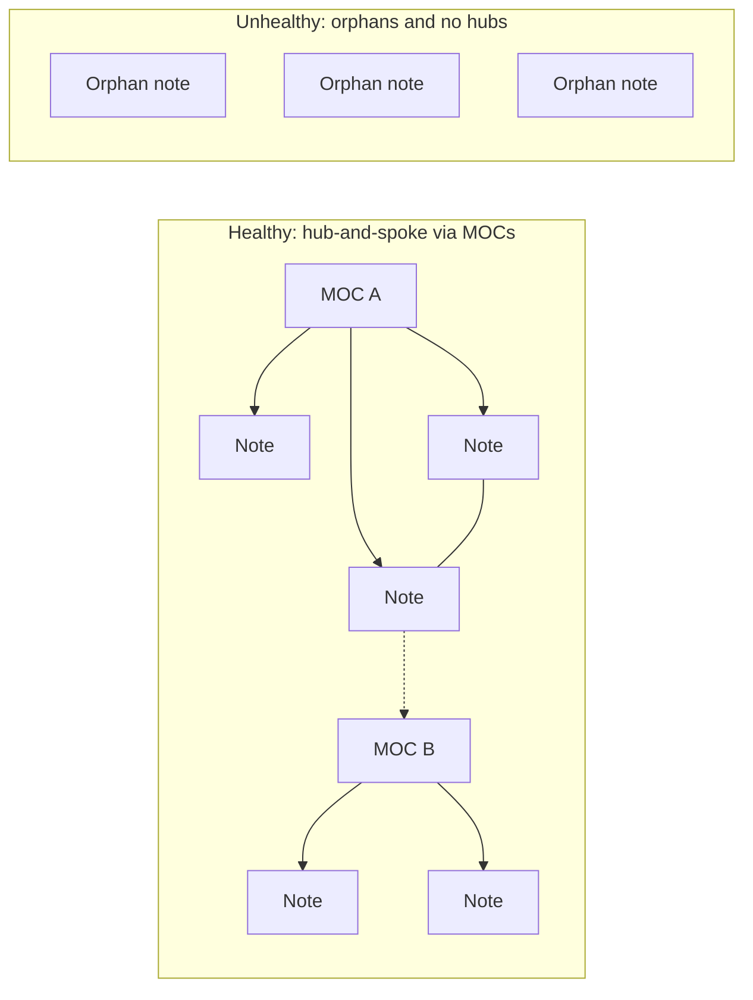

# Linking and Graph Discipline

Links, not folders or tags, are what make graph view meaningful — see [[01 - Folder Structure]] and [[04 - Tagging]] for why those two carry other jobs. This note is about the third piece: the actual `[[wikilinks]]` that build the graph.

---

## 1. Minimum linking bar

- **Every note needs at least 2–3 outgoing links** to existing notes. An unlinked note is a dead node — it doesn't show up in any traversal, local graph, or Dataview query built on links.
- **Link liberally, even to notes that don't exist yet.** An unresolved link is a natural to-do list of ideas worth fleshing out later, not a mistake to avoid.
- **Don't over-link common words.** Link only where the connection is *meaningful*; linking every mention of "AI" or "project" turns graph view into noise instead of structure.

## 2. MOCs are the graph's anchors

A MOC (Map of Content) is a hub note for one major domain — `05-MOCs/Tag Index.md` is one, and any future `MOC - Mnemos.md`-style note would be another. MOCs:

- Link out to every atomic note in their cluster.
- Are what keeps graph view showing clusters-with-hubs instead of a flat hairball.
- Get created once a topic folder accumulates enough atomic notes that a reader would otherwise have to guess what exists.

## 3. What a healthy vs. unhealthy graph looks like

Orphan notes (no links in or out) are a review-worthy signal, not a permanent state — see [[08 - Review and Maintenance Cadence]] for the sweep that catches them.

## 4. Graph view settings

- Color tags by group in graph settings — separates domains visually at a glance.
- Filter out function folders: `-path:"06-Templates" -path:"Attachments" -path:".obsidian"` (see [[01 - Folder Structure]]).
- Use **local graph** (per-note) for day-to-day navigation; reserve the **global graph** for occasional structural audits during the monthly review.

## 5. Rederiving, not just storing

The actual point of a second brain is being able to rebuild your reasoning later, not just re-read stored facts:

- Resource notes end with a **"My Take"** section — see [[06 - Note Structure and Templates]] for the exact template. Restating an idea in your own words is what makes it rederivable later.
- Daily notes link back to whatever atomic notes they touched, building a timeline of when an idea resurfaced and why.
- Dataview queries (e.g. "all evergreen notes tagged `#pkm`") turn the vault into a queryable database on top of the link graph, not just a wiki you browse by hand.
