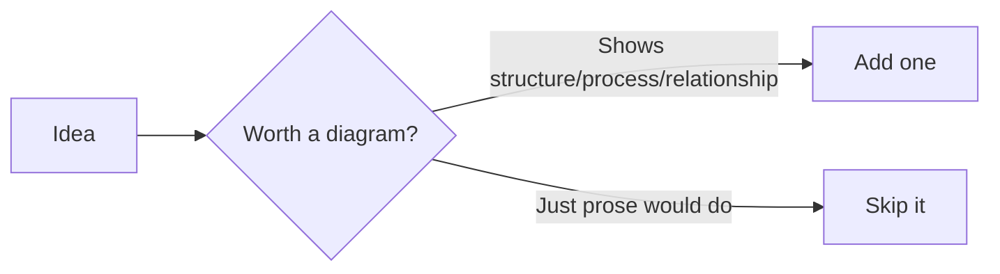

# Mermaid Diagram Standards

A diagram earns its place when it shows a *shape* text can't — a hierarchy, a decision path, a pipeline, a relationship between more than two things at once. It doesn't earn its place as decoration. Obsidian renders ```` ```mermaid ```` code blocks natively — no plugin required.

---

## 1. When a diagram is required, not optional

| Note situation | Required? |
|---|---|
| Any `moc` note | **Required** — a structure diagram of what it links to |
| A note documenting architecture (e.g. Mnemos's pipeline) | **Required** |
| A note documenting a process/sequence (e.g. dev startup steps, a research workflow) | **Required** |
| A note comparing multiple options (e.g. the PKM tools survey) | **Recommended** — a diagram often clarifies a comparison table faster than more table rows |
| An ordinary atomic resource/fleeting note | Not required — don't force one in |

## 2. Diagram type by purpose

| Purpose | Mermaid type | Example in this vault |
|---|---|---|
| Hierarchy / taxonomy | `mindmap` | [[04 - Tagging]]'s tag taxonomy |
| Process / decision path | `flowchart` | [[01 - Folder Structure]]'s "where does this go" tree |
| Relationships / clusters | `graph` | [[05 - Linking and Graph Discipline]]'s healthy-vs-unhealthy graph |
| Sequence of steps over time | `sequenceDiagram` | a future Mnemos request-flow note |
| Timeline / roadmap | `timeline` | a future project-roadmap note |

## 3. Style rules

- **Keep it under ~15 nodes.** A diagram that needs more than that is covering more than one idea — split it into a parent diagram (in a MOC) linking to child diagrams (in the atomic notes), the same way notes themselves get split.
- **Don't hardcode colors.** Mermaid inherits Obsidian's active theme by default; a hand-picked color scheme breaks in the other theme (light vs. dark) and looks wrong for half your readers.
- **Label edges when the relationship isn't obvious from direction alone** (e.g. `-->|Yes|`, `-->|promote|`), not just bare arrows.
- **Node IDs stay short and stable** (`A`, `B`, `N1`) so diagrams are easy to edit later; put the readable text in the label, not the ID.

## 4. Minimal example


