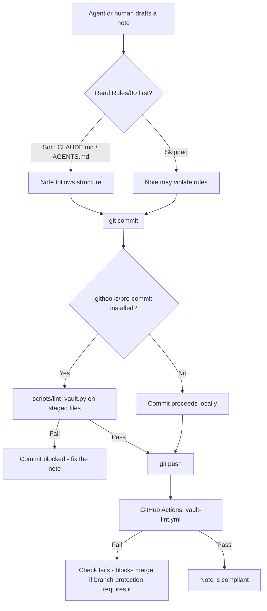

# Agent and AI Assistant Protocol

This vault is edited by more than one kind of writer: the vault owner directly in Obsidian, and AI coding agents (Claude Code — locally and in cloud sessions — and potentially other assistants) committing directly to the git repo. Rules 01–09 only produce a coherent, readable graph if every writer actually follows them. This note is about making that true for the AI-agent case specifically, where "read the rules first" can't be assumed by default.

---

## 1. The mandatory pre-flight sequence for any agent

Before creating, editing, or committing any `.md` file in this repo:

1. Read [[00 - Rules Index]] in full.
2. Identify the note's `type` (see [[03 - Frontmatter and Metadata]]) and open the specific rule notes that apply — at minimum 01 (folder), 02 (naming), 03 (frontmatter), 04 (tags), 05 (links), 06 (body structure), and 07 if a diagram is warranted.
3. Draft the note honoring all of them, not just frontmatter — a note with perfect YAML and no outgoing links still fails [[05 - Linking and Graph Discipline]].
4. Self-check against the condensed checklist in [[00 - Rules Index]].
5. Stage and commit.

## 2. Soft enforcement — and its limit

`CLAUDE.md` and `AGENTS.md` at the repo root point directly at [[00 - Rules Index]] and this note, so any agent that reads its startup context (Claude Code does this automatically; several other coding assistants read `AGENTS.md` the same way) sees the rules before writing anything. This is necessary, but it's not sufficient on its own — it depends on the agent's tooling actually loading that file, and on the agent choosing to follow it rather than skim it. Treat it as a strong nudge, not a guarantee.

## 3. Hard enforcement — the actual backstop

`scripts/lint_vault.py` checks a changed note against the schema in [[03 - Frontmatter and Metadata]] and the naming rules in [[02 - File Naming]] mechanically, with no dependence on anyone having read anything. It's wired in at two points:

- **`.githooks/pre-commit`** — blocks a noncompliant commit locally, once `bash scripts/setup-hooks.sh` has been run in a given clone (this sets `git config core.hooksPath .githooks`).
- **`.github/workflows/vault-lint.yml`** — runs on every push and pull request on GitHub, regardless of whether the local hook was ever installed. This is the layer that actually can't be skipped by a fresh clone, a cloud session, or an agent that never ran the setup script.

For the CI layer to actually block a merge (rather than just fail a check that can be ignored), the repo's branch protection on `main` needs "require status checks to pass" enabled for the `Vault Lint` check — that's a one-time GitHub setting, not something a commit can configure for itself.

## 4. What the lint script does and doesn't catch

It catches: missing/incomplete frontmatter, invalid `type`/`status` values, malformed dates, tag count outside 1–7, and placeholder or cross-platform-unsafe filenames. It does **not** catch: whether the linking discipline in [[05 - Linking and Graph Discipline]] is followed, whether the body structure in [[06 - Note Structure and Templates]] is present, or whether a diagram in [[07 - Mermaid Diagram Standards]] is actually warranted — those require reading the note, not just parsing it. That gap is exactly why step 1–4 of the pre-flight sequence in §1 still matters even with the hard layer in place.

## 5. If you are an AI assistant reading this

Don't treat this note as background context to summarize back — treat it as an instruction that applies to the very next file you touch. If you're about to create or edit a `.md` file in this repo and haven't yet opened [[00 - Rules Index]] and the specific rule notes it links to, do that first.
