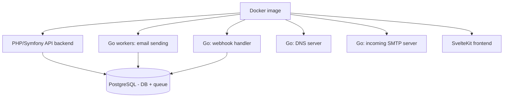

# Hyvor Relay

## TL;DR

Hyvor Relay is a self-hosted, open-source (AGPL-3.0) transactional email API built by bootstrapped French company HYVOR, SARL — positioned as a data-sovereign, no-per-message-fee alternative to AWS SES, Mailgun, and SendGrid. It bundles an HTTP API, SMTP server, DNS server, email/webhook workers, and DKIM/SPF/bounce/suppression automation into a single Docker image backed only by PostgreSQL.

Young but actively developed and genuinely usable: publicly introduced December 1, 2025, at v0.0.45 (June 4, 2026) across 63 releases, ~620–710 GitHub stars, a small core team (~3 main contributors). Choose it if you want control, privacy, and cost savings at scale (roughly >50k emails/month) and have the ops skills to run a mail server — self-hosting does **not** solve IP reputation/deliverability, which stays your responsibility regardless of software.

## What it is

A transactional-first email **sending** API (MTA/relay) for applications — not a mailbox/IMAP server, and not a newsletter platform. It emerged as internal infrastructure HYVOR built for its privacy-first newsletter product, Hyvor Post, after finding that "nearly all" existing email providers bundled tracking. Both products launched publicly December 1, 2025, under AGPLv3.

## Architecture at a glance

Everything ships in one Docker image; PostgreSQL is the only external dependency (used as both database *and* queue — no separate broker like RabbitMQ). Auth is OIDC-only; there's no built-in login system.

## Metadata

| Field | Value |
|---|---|
| Repo | [github.com/hyvor/relay](https://github.com/hyvor/relay) |
| License | AGPL-3.0 (+ enterprise license from €10,000/yr, feature-identical) |
| Latest version | 0.0.45 (Jun 4, 2026), 63 releases total — still pre-1.0 |
| Stars / Forks | ~620–710 / ~34–37 (snapshot, rising) |
| Contributors | ~3 primary (small-team/key-person risk) |
| Stack | PHP/Symfony (API), Go (workers/DNS/SMTP), SvelteKit (frontend), PostgreSQL |
| Deployment | Docker Compose (single server) or Swarm (HA), host network mode |

## Detail notes

- [[Hyvor Relay - Features and Architecture]] — full feature list, tech stack, self-hosting requirements
- [[Hyvor Relay - Comparison]] — vs. AWS SES, SendGrid, Mailgun, and Postal
- [[Hyvor Relay - Licensing and Maturity]] — AGPL-3.0 terms, activity/versioning, known limitations
- [[Hyvor Relay - Recommendation]] — adoption thresholds, pilot plan, caveats

## My Take

The headline number worth remembering is the ~50k emails/month threshold — below that, the engineering time to run this yourself outweighs the savings versus SES; above it, the math flips in Relay's favor. That threshold is directly checkable against my own [[AWS & Amazon SES]] cost-estimation work (~45,000 emails/month) — close enough to the breakeven point that this is worth revisiting concretely if that volume grows, not a hypothetical comparison.

## Related

- [[Tools]]
- [[AWS & Amazon SES]]
- [[Hyvor Relay - Comparison]]
