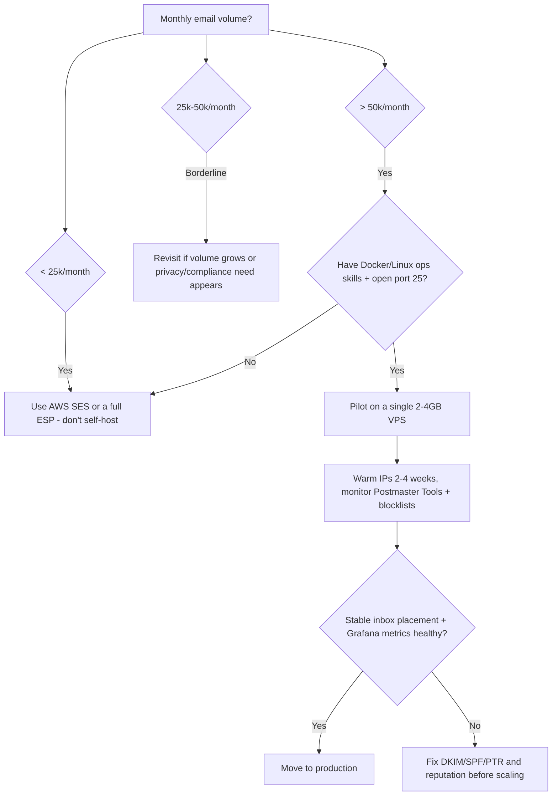

# Hyvor Relay - Recommendation

## Decision path

## Recommendations

1. **Below ~25k emails/month or without mail-ops experience**: don't self-host. Use AWS SES (cheapest managed) or a full-service ESP (Postmark/SendGrid/Mailgun) and revisit later. Reconsider once sustained volume passes ~50k/month, or a hard data-residency/privacy/compliance requirement appears.
2. **Above that threshold, with IPv4 sending capability (port 25 open) and Docker/Linux ops skills**: pilot Relay on a single 2–4GB VPS with Docker Compose + managed Postgres + an OIDC provider. Success benchmarks before production: clean DKIM/SPF/PTR, inbox placement on Gmail/Outlook/Yahoo seed tests, and a stable Grafana view of send/bounce rates.
3. **Warm IPs and isolate traffic from day one**: use the transactional vs. distributional queues immediately, warm new IPs gradually over 2–4 weeks, and monitor Google Postmaster Tools + blocklists — this determines deliverability, not the software choice.
4. **For regulated/enterprise use** needing SLAs, AGPL-disclosure-free modifications, or legal clarity: weigh the enterprise license (from €10,000/yr) against projected ESP spend; only worth it if the annual fee undercuts the alternative and HYVOR's support has real value to you.
5. **If you want zero infrastructure**: wait for Hyvor Relay Cloud (planned Q1 2026) or use an established managed provider now — treat the €30/300k pricing as provisional until launch.
6. **Mitigate project risk**: pin versions, keep your own Postgres backups, and track releases/issues before committing critical flows through a 0.0.x, ~3-contributor project.

## Caveats

- Star/fork/issue counts vary by snapshot across mid-2026 (e.g. 623 vs. 700 vs. 706 stars observed within days) — treat as approximate and rising.
- Contributor count (~3) is inferred from release notes and avatars, not a directly confirmed GitHub contributor graph.
- Cloud pricing (€30/mo for 300k) and the Q1 2026 launch are forward-looking, explicitly labeled "estimated"/"planned" by HYVOR, and had not occurred as of this research.
- Cost comparisons (SES/SendGrid/Mailgun figures, the ~$20–50/mo VPS estimate) come from third-party 2026 pricing analyses and vendor pages — actual costs depend on IPs, attachments, data transfer, and add-ons.
- Some enthusiastic third-party coverage uses marketing language and should be read critically; independent, production-grade reviews remain scarce given the product's youth.
- "Millions of daily emails" and "battle-tested" claims originate largely from the vendor and its own launch coverage, not yet from large independent deployments.

## My Take

The honest bottom line is that Relay doesn't change the hardest part of self-hosted email — deliverability — it only removes the per-message software fee. That's a real, meaningful trade at scale, but it's not a reason to self-host below the ~50k/month line just because the software is good. My own [[AWS & Amazon SES]] volume estimate (~45,000/month) sits close enough to that line that this is worth tracking as volume grows, not acting on now.

## Related

- [[Hyvor Relay - Licensing and Maturity]]
- [[AWS & Amazon SES]]
- [[Hyvor Relay - Brief]]
