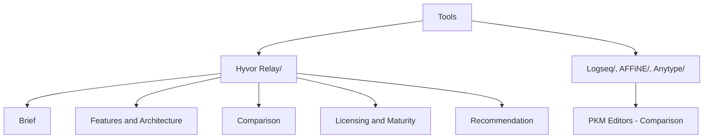

# Tools

Hub for single-tool deep-dive research — evaluating one specific existing tool/product for possible adoption, as distinct from [[App Ideas]] (concepts I might build) and [[Active Projects]] (infrastructure I already reuse). Each tool gets its own subfolder, researched using [[Git Repo Research Framework]] and the [[Repo Research Kickoff Prompt (Template)]] methodology.

## Structure

## Tools researched

| Tool | What it is | Verdict |
|---|---|---|
| [[Hyvor Relay - Brief\|Hyvor Relay]] | Self-hosted, open-source transactional email API (SES/Mailgun/SendGrid alternative) | Pilot-worthy above ~50k emails/month with ops capacity; not worth it below that |
| [[Logseq - Brief\|Logseq]] | Block-outliner PKM tool, mid-transition to a SQLite-backed DB version | Evaluate further — file version only |
| [[AFFiNE - Brief\|AFFiNE]] | Unified doc-editor + whiteboard, open-core | Evaluate further — EE-gated backend |
| [[Anytype - Brief\|Anytype]] | "Everything is an object" PKM tool with real MCP support | Reject — proprietary object format |

## Cross-tool comparisons

| Comparison | Tools covered | Verdict |
|---|---|---|
| [[PKM Editors - Comparison]] | Logseq, AFFiNE, Anytype | No tool wins on both portability and AI/MCP readiness; Logseq (file version) ranks first for a portability-first vault |

## Related

- [[Git Repo Research Framework]]
- [[App Ideas]]
- [[Active Projects]]
